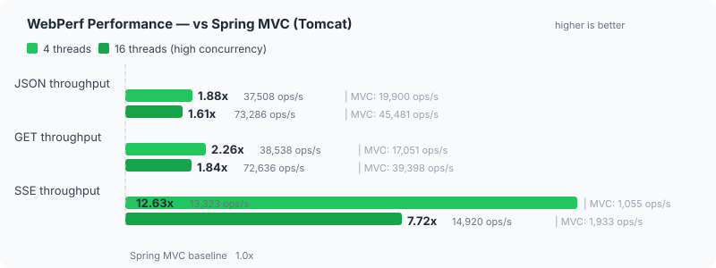

> English | [中文](README_CN.md)

# Spring WebPerf

A high-performance Netty-based web framework, compatible with Spring MVC programming model — high performance, zero compromise.

[](https://github.com/springperf/spring-web/actions/workflows/ci.yml)
[](https://central.sonatype.com/artifact/io.github.springperf/spring-web)
[](LICENSE.md)
[](docs/en/benchmark.md)
[](docs/en/benchmark.md)

---

## Performance at a Glance

<p align="center">

</p>

> **100% win rate** — perf is **#1 on all 7 APIs × 3 concurrency levels** vs Spring MVC (Tomcat/Undertow) and WebFlux, no exceptions. json p50 at 16 threads is just **69%** of Spring MVC, allocation per request **43%** of it, and heap at 4 threads is **24MB** (the lowest).
>
> [Full Benchmark Report](docs/en/benchmark.md) · [Performance Principles](docs/en/performance-principles.md)

> **Why this approach?** — A three-layer argument: why batching beats non-blocking, why CPU optimization is the next frontier, and why combining both is the complete solution.
>
> [The Complete Path to High-Performance Java Web →](docs/en/philosophy.md)

---

## Origin

> During performance testing in a 1c1g environment, the same business logic (device data ingestion + validation + Redis/ClickHouse writes) achieved ~**15,000** TPS on the Kafka consumer side, but less than **4,000** TPS on the Spring MVC endpoint. CPU hotspot analysis revealed that the Spring MVC framework itself consumed the majority of CPU cycles — parameter resolution, route matching, reflective invocation — overhead unrelated to business logic yet dominating performance. Spring WebFlux exhibited similar framework-level costs.
>
> This raised a question: what if we eliminated all unnecessary runtime overhead from the mainstream Spring MVC feature set? How much could performance improve?
>
> **Spring WebPerf was born from this question.** Goal: maximize web framework performance while remaining fully compatible with the Spring ecosystem.
>
> [View Benchmark Report](docs/en/benchmark.md) · [Performance Principles](docs/en/performance-principles.md) · [Full Origin Story](docs/en/overview.md)

---

## Introduction

Spring WebPerf is a high-performance web framework built on **Netty 4.1**, designed as a high-performance alternative to Spring MVC. It preserves the familiar Spring programming model (annotation-driven, dependency injection, interceptors, etc.), but through startup pre-caching, zero-reflection runtime, and other engineering optimizations, delivering higher throughput and lower resource consumption while staying compatible with the Spring ecosystem.

---

## Key Features

- **High Performance** — Pre-caches all metadata at startup, zero reflection and zero matching at runtime; ASM bytecode generation replaces reflective invocation; O(1) HashMap routing; GC-friendly design
- **Netty-Driven** — Built on Netty 4.1 event-driven I/O; requests execute on EventLoop by default, with method-level `@RunInPool` scheduling to business thread pools as needed
- **Spring Ecosystem Compatible** — Supports `@RestController`, `@RequestMapping`, `@Validated`, `@ExceptionHandler`, `HandlerInterceptor`, and other Spring annotations and abstractions — zero-code migration
- **Async Native** — Built-in support for DeferredResult, Callable, SseEmitter, StreamEmitter, Reactive Streams; SSE throughput reaches 12.63x of Spring MVC at 4 threads / 7.72x at 16 threads
- **Batch Processing** — Disruptor-based request aggregation that transparently merges concurrent requests into batch operations, boosting throughput by multiple times; supports backpressure strategies, wait strategies, and thread pool isolation
- **Extensible** — SPI at every key juncture: argument resolvers, return value handlers, codec interceptors, filters, interceptors
- **Ecosystem Bridge** — The `support` module bridges Servlet Filters, Spring MVC `HandlerInterceptor`, `RequestBodyAdvice` / `ResponseBodyAdvice`
- **Server-Side Rendering** — Optional `spring-web-view` module adds Thymeleaf / FreeMarker template rendering; `@Controller` + `Model` + view-name programming model matches Spring MVC
- **Actuator Integration** — Supports Spring Boot Actuator with optional standalone management port

---

## Quick Start

### 1. Add Dependency

```xml
<dependency>
    <groupId>io.github.springperf</groupId>
    <artifactId>spring-boot-starter-web</artifactId>
    <version>${spring-web.version}</version>
</dependency>
```

### 2. Write a Controller

```java
@RestController
@RequestMapping("/api")
public class HelloController {

    @GetMapping("/hello/{name}")
    public String hello(@PathVariable String name) {
        return "Hello, " + name;
    }

    @PostMapping("/echo")
    public ApiResult<?> echo(@RequestBody Map<String, Object> body) {
        return ApiResult.success(body);
    }
}
```

### 3. Start

```java
@SpringBootApplication
public class Application {
    public static void main(String[] args) {
        SpringApplication.run(Application.class, args);
    }
}
```

### 4. Configuration

```yaml
server:
  port: 8080
  servlet:
    context-path: /api               # Application context path (optional)
  http:
    max-content-length: 5242880      # Max request body, default 1MB
    timeout: 15000                   # Request timeout, default 60s (milliseconds)
management:
  server:
    port: 8081                       # Actuator standalone management port (optional)
```

> See [Configuration Reference](docs/en/configuration.md) for the full list.
>
> Migrating from Spring Boot (Spring MVC)? See the [Migration Guide](docs/en/quickstart.md).
>
> Migrating from Spring AI? See the [AI Integration Guide](docs/en/ai-guide.md).

---

## Benchmark

> Full report: [Benchmark Document](docs/en/benchmark.md)
> Performance analysis: [Performance Principles](docs/en/performance-principles.md)

JMH benchmark results on JDK 17 + G1GC (1GB heap, 4 threads):

| API | perf throughput | vs Spring MVC (Tomcat) | vs Spring MVC (Undertow) | vs WebFlux |
|-----|---------------|-----------|-------------|-------------|
| json | **37,508** ops/s | **1.88x** | **1.92x** | **2.07x** |
| get | **38,538** ops/s | **2.26x** | **2.19x** | **2.49x** |
| bytes | **42,017** ops/s | **1.56x** | **1.52x** | **1.69x** |
| valid | **35,949** ops/s | **1.79x** | **1.81x** | **2.04x** |
| async | **40,501** ops/s | **2.12x** | **2.31x** | **1.67x** |
| bytesLarge | **18,250** ops/s | **1.82x** | **1.45x** | **1.55x** |
| sse | **13,323** ops/s | **12.63x** | — | **5.08x** |

The perf framework delivers **1.6\~12.6x** throughput over Servlet containers, with **0.10\~0.11ms** p50 latency (lowest among peers). SSE reaches **12.63x** of Spring MVC at 4 threads and **7.72x** at 16 threads. See [full comparison report](docs/en/benchmark.md).

---

## Comparison with Spring MVC

| Dimension | WebPerf | Spring MVC (Tomcat) |
|-----------|-----------|---------------------|
| Engine | Netty 4.1.115.Final | Spring MVC 6.1.15 + Tomcat 10.1.33 (Undertow 2.3.17.Final) |
| Throughput (json 4t) | **37,508** ops/s | 19,900 ops/s (1.88x) |
| P50 Latency (bytes 4t) | **0.10ms** | 0.15ms |
| Steady-state heap (4t) | **24MB** | 26MB |
| I/O model | Netty non-blocking transport + EventLoop | Servlet blocking I/O + container threads |
| Thread model | EventLoop direct or `@RunInPool` on-demand | Fixed container thread pool |
| Method invocation | ASM / MethodHandle (~10-30ns) | `Method.invoke()` reflection (~200ns) |
| Argument resolution | Pre-cached at startup, direct call at runtime | Per-request iteration + `synchronized` cache |
| Routing | O(1) HashMap multi-level optimizer | `AntPathMatcher` linear traversal |
| Servlet API | Bridged via support module | Native |
| Actuator | Native | Native |

---

## Version Selection

This project manages two branches aligned with Spring Boot major versions. Minimum supported: **Spring Boot 2.4.x**.

| Branch | Spring Boot | Spring Framework | JDK | Servlet API | Status |
|--------|------------|----------------|-----|-------------|--------|
| `2.7.x` | 2.4.x ~ 2.7.x | 5.3.x | 8 / 11 / 17 | javax.servlet 4.0 | Maintenance branch (features + bugfix) |
| `master` | 3.0.x ~ 3.5.x / 4.0.x ~ 4.1.x | 6.0.x ~ 6.2.x / 7.0.x | 17 / 21 | jakarta.servlet 6.0 | **Development baseline** (multi-version via profiles) |

> See [Version Compatibility](docs/en/compatibility.md) for version floor notes, branch recommendations, and detailed compatibility information.

---

## Modules

| Module | Description |
|--------|-------------|
| `spring-web` | Core: Netty server, request dispatch, mapping registration, exception handling |
| `spring-web-view` | View rendering: Thymeleaf / FreeMarker template engines (optional) ¹ |
| `spring-web-support` | Spring MVC compatibility: `HandlerInterceptor`, `View` adapters, etc. ² |
| `spring-web-websocket` | WebSocket support: Spring WebSocket + Netty |
| `spring-web-batch` | Batch processing: high-performance message aggregation via Disruptor |
| `spring-boot-starter-web` | Spring Boot Starter: auto-configuration, Actuator support |
| `spring-web-test` | Integration tests |
| `spring-web-support-test` | Spring MVC compatibility tests |
| `spring-web-examples` | Usage examples for various scenarios |

> ¹ View rendering usage and Spring MVC differences: [View Rendering](docs/view.md).
>
> ² Some classes in the support module use `org.springframework.web.servlet` package paths (e.g., `HandlerInterceptor`), intentionally matching Spring WebMVC's official package paths — code written against Spring MVC interfaces can run without import changes. However, this means the support module and `spring-webmvc` **cannot coexist** — having both on the classpath will cause class conflicts at runtime. Under Java 9+ module system this also triggers split package errors. Choose one or the other.
>
> Further reading: [Modules](docs/en/modules.md) · [Extension Points](docs/en/extensions.md) · [Advanced Topics](docs/en/advanced.md)

---

## Contributing

See [CONTRIBUTING.md](CONTRIBUTING.md).

---

## License

[Apache License 2.0](LICENSE.md)