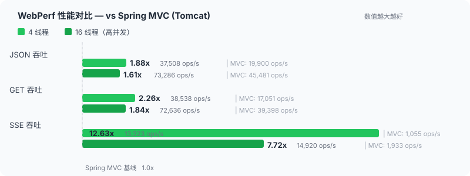

> [English](README.md) | 中文

# Spring WebPerf

基于 Netty 的高性能 Web 框架，兼容 Spring MVC 编程模型，零妥协的性能方案。

[](https://github.com/springperf/spring-web/actions/workflows/ci.yml)
[](https://central.sonatype.com/artifact/io.github.springperf/spring-web)
[](LICENSE.md)
[](docs/benchmark.md)
[](docs/benchmark.md)

---

## 性能概览

<p align="center">

</p>

> 全部 7 个接口 × 3 个并发度，对比 Spring MVC（Tomcat/Undertow）与 WebFlux **100% 领先，无一例外**。json 16t p50 延迟仅 Spring MVC 的 **69%**、每请求内存分配仅其 **43%**、4 线程堆占用 **24MB**（全场最低）。
>
> [完整 Benchmark 报告](docs/benchmark.md) · [性能原理详解](docs/performance-principles.md)

> **为什么是这个方案？** —— 三层论证：批处理为何优于非阻塞、CPU 优化为何是下一关、两者叠加为何才是完整方案。
> 
> [高性能 Java Web 的完整路径 →](docs/philosophy.md)

---

## 缘起

> 一次 1c1g 环境的性能测试中，同样的业务逻辑（设备数据上报 + 校验 + Redis/ClickHouse 写入），Kafka 消费端 TPS 接近 **15,000**，而 Spring MVC 接口不到 **4,000**。CPU 热点分析显示，Spring MVC 框架自身消耗了大量 CPU——参数解析、路由匹配、反射调用……这些开销与业务无关，却吞噬了绝大部分性能。Spring WebFlux 也存在类似的框架层开销。
>
> 这引发了一个思考：如果把 Spring MVC 主流功能中那些不必要的运行时开销全部消除，性能能提升多少？
>
> **Spring WebPerf 由此而生。** 目标：在兼容 Spring 生态的前提下，最大程度释放 Web 框架的性能。
>
> [查看 Benchmark 报告](docs/benchmark.md) · [性能原理详解](docs/performance-principles.md) · [项目缘起全文](docs/overview.md)

---

## 简介

Spring WebPerf 是一个基于 **Netty** 构建的高性能 Web 框架，定位为 Spring MVC 的高性能替代方案。它保留了 Spring 开发者熟悉的编程模型（注解驱动、依赖注入、拦截器等），但通过启动时预缓存、零反射运行时等优化手段，在兼容 Spring 生态的前提下提供更高的吞吐量和更低的资源占用。

---

## 核心特性

- **高性能** — 启动时预缓存全部元数据，运行时零反射零匹配；ASM 字节码生成替代反射调用；O(1) HashMap 路由；GC 友好设计
- **Netty 驱动** — 基于 Netty 4.1 事件驱动 I/O，请求默认在 EventLoop 处理，可按方法粒度通过 `@RunInPool` 调度到业务线程池
- **Spring 生态兼容** — 支持 `@RestController`、`@RequestMapping`、`@Validated`、`@ExceptionHandler`、`HandlerInterceptor` 等 Spring 注解与抽象，零侵入迁移
- **异步原生** — 内置 DeferredResult、Callable、SseEmitter、StreamEmitter、Reactive Streams 支持，SSE 吞吐达 Spring MVC 的 12.63x（4 线程）/ 7.72x（16 线程）
- **批量处理** — 基于 Disruptor 的请求聚合批处理，透明地将并发请求合并为批量操作，吞吐量可提升数倍；支持背压策略、等待策略、线程池隔离
- **灵活扩展** — 参数解析器、返回值处理器、编解码 Advice、拦截器、过滤器等关键节点均提供 SPI
- **生态桥接** — 可通过 support 模块桥接 Servlet Filter、Spring MVC `HandlerInterceptor`、`RequestBodyAdvice` / `ResponseBodyAdvice`
- **Actuator 集成** — 支持 Spring Boot Actuator，可配置独立管理端口

---

## 快速开始

### 1. 添加依赖

```xml
<dependency>
    <groupId>io.github.springperf</groupId>
    <artifactId>spring-boot-starter-web</artifactId>
    <version>${spring-web.version}</version>
</dependency>
```

### 2. 编写 Controller

```java
@RestController
@RequestMapping("/api")
public class HelloController {

    @GetMapping("/hello/{name}")
    public String hello(@PathVariable String name) {
        return "Hello, " + name;
    }

    @PostMapping("/echo")
    public ApiResult<?> echo(@RequestBody Map<String, Object> body) {
        return ApiResult.success(body);
    }
}
```

### 3. 启动

```java
@SpringBootApplication
public class Application {
    public static void main(String[] args) {
        SpringApplication.run(Application.class, args);
    }
}
```

### 4. 配置

```yaml
server:
  port: 8080
  servlet:
    context-path: /api               # 应用上下文路径（可选）
  http:
    max-content-length: 5242880      # 最大请求体，默认 1MB
    timeout: 15000                   # 请求超时，默认 60s（毫秒）
management:
  server:
    port: 8081                       # Actuator 独立管理端口（可选）
```

> 完整配置参考见 [配置文档](docs/configuration.md)。
>
> 从 Spring Boot（Spring MVC）项目迁移？查看[迁移指南](docs/quickstart.md)。
>
> 从 Spring AI 项目迁移？查看[AI 集成指南](docs/ai-guide.md)。

---

## 基准测试

> 详细报告见 [Benchmark 文档](docs/benchmark.md)
> 性能原理分析见 [性能原理文档](docs/performance-principles.md)

基于 JDK 17 + G1GC (1GB heap) 的 JMH 基准测试结果（4 线程）：

| 接口 | perf 吞吐 | vs Spring MVC (Tomcat) | vs Spring MVC (Undertow) | vs WebFlux |
|------|-----------|-----------|-------------|-------------|
| json | **37,508** ops/s | **1.88x** | **1.92x** | **2.07x** |
| get | **38,538** ops/s | **2.26x** | **2.19x** | **2.49x** |
| bytes | **42,017** ops/s | **1.56x** | **1.52x** | **1.69x** |
| valid | **35,949** ops/s | **1.79x** | **1.81x** | **2.04x** |
| async | **40,501** ops/s | **2.12x** | **2.31x** | **1.67x** |
| bytesLarge | **18,250** ops/s | **1.82x** | **1.45x** | **1.55x** |
| sse | **13,323** ops/s | **12.63x** | — | **5.08x** |

perf 框架吞吐是 Servlet 容器的 **1.6\~12.6x**，p50 延迟 **0.10\~0.11ms**（同类框架最低）。SSE 4 线程达 Spring MVC 的 **12.63x**、16 线程 **7.72x**。详情见 [完整对比报告](docs/benchmark.md)。

---

## 与 Spring MVC 对比

| 维度 | WebPerf | Spring MVC (Tomcat) |
|------|-----------|---------------------|
| 底层引擎 | Netty 4.1.115.Final | Spring MVC 6.1.15 + Tomcat 10.1.33（Undertow 2.3.17.Final） |
| 吞吐量 (json 4t) | **37,508** ops/s | 19,900 ops/s (1.88x) |
| P50 延迟 (bytes 4t) | **0.10ms** | 0.15ms |
| 稳态堆占用 (4t) | **24MB** | 26MB |
| I/O 模型 | Netty 非阻塞传输 + EventLoop 处理 | Servlet 阻塞 I/O + 容器线程 |
| 线程模型 | EventLoop 直接处理或 `@RunInPool` 按需切换 | 固定容器线程池 |
| 方法调用 | ASM / MethodHandle（~10-30ns） | `Method.invoke()` 反射（~200ns） |
| 参数解析 | 启动时预缓存，运行时直接调用 | 每次请求遍历 + `synchronized` 缓存 |
| 路由 | O(1) HashMap 多级优化器 | `AntPathMatcher` 线性遍历 |
| Servlet API | 通过 support 模块桥接 | 原生支持 |
| Actuator | 原生支持 | 原生支持 |

---

## 版本选择

本项目按 Spring Boot 大版本管理两个分支。最低支持 **Spring Boot 2.4.x**。

| 分支 | Spring Boot | Spring Framework | JDK | Servlet API | 状态 |
|------|------------|----------------|-----|-------------|------|
| `2.7.x` | 2.4.x ~ 2.7.x | 5.3.x | 8 / 11 / 17 | javax.servlet 4.0 | 维护分支（功能迭代 + bugfix） |
| `master` | 3.0.x ~ 3.5.x / 4.0.x ~ 4.1.x | 6.0.x ~ 6.2.x / 7.0.x | 17 / 21 | jakarta.servlet 6.0 | **开发基线**（多版本兼容，切换 Profile） |

> 版本下限说明、分支选择建议及详细兼容性信息见 [版本兼容性说明](docs/compatibility.md)。

---

## 模块说明

| 模块 | 说明 |
|------|------|
| `spring-web` | 核心模块：Netty 服务器、请求分发、映射注册、异常处理等 |
| `spring-web-support` | Spring MVC 兼容模块：提供 `HandlerInterceptor`、`View` 等适配类 ¹ |
| `spring-web-websocket` | WebSocket 支持模块：基于 Spring WebSocket + Netty |
| `spring-web-batch` | 批处理模块：基于 Disruptor 的高性能消息聚合与批量处理 |
| `spring-boot-starter-web` | Spring Boot Starter：自动配置、Actuator 支持 |
| `spring-web-test` | 集成测试模块 |
| `spring-web-support-test` | Spring MVC 兼容测试模块 |
| `spring-web-examples` | 各场景使用示例 |

> ¹ support 模块中部分类使用了 `org.springframework.web.servlet` 包路径（如 `HandlerInterceptor`），与 Spring WebMVC 官方包路径相同。这是有意为之——基于 Spring MVC 接口编写的代码可不改 import 直接运行。但这也意味着本模块与 `spring-webmvc` **二者不能同时存在**，否则运行时会产生类冲突。Java 9+ 模块化系统下也会触发 split package 错误，请务必二选一。
>
> 更多说明：[模块详解](docs/modules.md) · [扩展点指南](docs/extensions.md) · [高级主题](docs/advanced.md)

---

## 如何贡献

请参阅 [CONTRIBUTING.md](CONTRIBUTING.md)。

---

## 许可证

[Apache License 2.0](LICENSE.md)