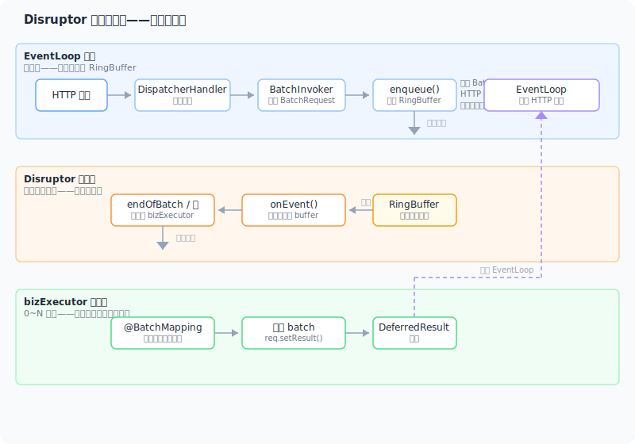

> [English](en/batch.md) | 中文

# Batch 批处理模块

`spring-web-batch` 将高并发的独立请求透明聚合为批量，由批量处理方法一次处理完所有请求，适合 IO 密集型场景（批量 DB 查询、批量 RPC 调用）。

基于 **LMAX Disruptor** 实现无锁环形缓冲区，提供背压策略、等待策略、线程池隔离等生产级特性。

---

## 目录

- [快速开始](#快速开始)
- [@BatchMapping 注解](#batchmapping-注解)
- [架构设计](#架构设计)
- [可观测性](#可观测性)
- [配置参考](#配置参考)
- [注意事项](#注意事项)

---

## 快速开始

### 1. 添加依赖

```xml
<dependency>
    <groupId>io.github.springperf</groupId>
    <artifactId>spring-web-batch</artifactId>
    <version>${spring-web.version}</version>
</dependency>
```

`spring-boot-starter-web` 中 `spring-web-batch` 声明为 `<scope>provided</scope>`，即使使用了 starter 也需要单独添加。

### 2. 编写 Controller

**第 1 步：定义单请求端点**

将普通 Controller 方法的返回值类型改为 `BatchRequest<R>`（即 `DeferredResult` 的子类），方法体不会实际执行：

```java
@RestController
@RequestMapping("/api")
public class UserController {

    @GetMapping("/users/{id}")
    public BatchRequest<UserResp> getUser(@PathVariable Long id,
                                          @RequestParam(defaultValue = "zh") String lang) {
        // 方法体不会执行，由 BatchInvoker 接管
        return null;
    }
}
```

**第 2 步：定义 BatchRequest 子类**

构造函数参数类型必须与单方法参数类型**按序一致**：

```java
public class GetUserRequest extends BatchRequest<UserResp> {

    private final Long id;
    private final String lang;

    public GetUserRequest(Long id, String lang) {
        this.id = id;
        this.lang = lang;
    }

    public Long getId() { return id; }
    public String getLang() { return lang; }
}
```

**第 3 步：编写批量处理方法**

在同一个 Controller 中编写 `@BatchMapping` 方法：

```java
@RestController
@RequestMapping("/api")
public class UserController {

    // ... 单请求端点

    @BatchMapping(method = "getUser")
    public void batchGetUser(List<GetUserRequest> batch) {
        Map<Long, UserResp> dbResult = userService.batchQuery(batch);
        for (GetUserRequest req : batch) {
            UserResp resp = dbResult.get(req.getId());
            req.setResult(resp != null ? resp : new UserResp());
        }
    }
}
```

- `@BatchMapping(method = "getUser")` 关联到单请求端点 `getUser`
- **唯一参数**必须为 `List<? extends BatchRequest<?>>`，即待处理的批量请求
- 处理完成后调用 `BatchRequest.setResult()` 完成每个请求的 HTTP 响应

---

## @BatchMapping 注解

```java
@Target(ElementType.METHOD)
@Retention(RetentionPolicy.RUNTIME)
public @interface BatchMapping {

    int ringBufferSize() default 4096;
    WaitStrategy waitStrategy() default WaitStrategy.BLOCKING;
    Backpressure backpressure() default Backpressure.BLOCK;
    String method() default "";
    int maxBatchSize() default 100;
    int consumerSize() default -1;

    enum WaitStrategy { YIELDING, BLOCKING, SLEEPING, BUSY_SPIN }
    enum Backpressure { BLOCK, DROP, THROW }
}
```

### 参数说明

| 参数 | 默认值 | 说明 |
|------|--------|------|
| `ringBufferSize` | 4096 | Disruptor 环形缓冲区容量，自动归一化为 2 的 N 次幂 |
| `waitStrategy` | BLOCKING | 消费者等待策略，见下方表格 |
| `backpressure` | BLOCK | 背压策略，见下方表格 |
| `method` | "" | 被关联的单请求方法名，默认与批量处理方法同名 |
| `maxBatchSize` | 100 | 单次批处理最大请求数，达到该值触发批量处理 |
| `consumerSize` | -1 | 最大并发处理线程数，默认 CPU 核数 |

### 背压策略

| 策略 | 行为 | 客户端响应 |
|------|------|-----------|
| `BLOCK` | 生产者线程（EventLoop）阻塞直到 RingBuffer 有空间 | 连接挂起，等待处理 |
| `DROP` | 丢弃请求，`BatchRequest` 收到 `BatchOverflowException` | **429 Too Many Requests** |
| `THROW` | 同步抛出 `BatchOverflowException` | **429 Too Many Requests** |

### 等待策略

| 策略 | 适用场景 | CPU 消耗 | 延迟 |
|------|---------|---------|------|
| `BLOCKING` | 空闲时段较多，省 CPU | 低 | 高 |
| `YIELDING` | 低延迟、中等吞吐 | 中 | 中 |
| `SLEEPING` | 省 CPU 但需要一定响应速度 | 低 | 中高 |
| `BUSY_SPIN` | 极致低延迟、高吞吐 | 高（始终占满 CPU） | 低 |

### 线程模型

`@BatchMapping` 为每个方法创建独立的 Disruptor 队列，内部线程模型：

```
EventLoop 线程（生产者）
    ↓ 入队 RingBuffer
Disruptor 消费者线程（1 个）
    ↓ 攒批 → 提交
bizExecutor 线程池（0 ~ consumerSize 个）
    ↓ 执行
@BatchMapping 方法
```

- **生产者**：EventLoop 线程直接调用 `BatchInvoker` 入队，无需 `@RunInPool`
- **消费者**：Disruptor 单消费者线程不断从 RingBuffer 拉取事件
- **业务线程池**：0 核心线程、`SynchronousQueue`、`CallerRunsPolicy`。空闲时零线程占用；满负荷时消费者线程自行执行形成背压

---

## 架构设计

### 请求流转

<p align="center">

</p>

### 核心组件

| 类 | 职责 |
|------|------|
| `BatchRequest<R>` | 继承 `DeferredResult<R>`，用户扩展的请求基类，通过构造参数位置匹配接收方法参数 |
| `@BatchMapping` | 标注在批量处理方法上，关联对应的单请求方法 |
| `BatchRegistry` | 管理所有 RingBuffer 生命周期（初始化/销毁），安装 `BatchInvoker` |
| `BatchInvoker` | 替换原 Controller 方法调用，直接根据构造参数创建 `BatchRequest` 实例并入队 |
| `DisruptorQueue` | 封装 LMAX Disruptor，提供入队/背压/关闭等操作 |
| `BufferingBatchHandler` | Disruptor 消费者，攒批达到阈值后提交到业务线程池 |

### 为什么用 Disruptor

- **无锁并发**：`ProducerType.MULTI` 支持多个 EventLoop 线程同时入队，无锁竞争
- **预分配事件槽**：`BatchEvent` 在 RingBuffer 中预创建，减少 GC 压力
- **endOfBatch 信号**：Disruptor 在批量发布结束时通知消费者，减少攒批延迟
- **背压自然**：生产者写入 RingBuffer 时，RingBuffer 满 → 生产者阻塞 → EventLoop 自然反压到 TCP 层

---

## 可观测性

### Metrics 指标

当 Micrometer 在类路径上时（通过 `spring-boot-starter-actuator` 引入），`spring-web-batch` 自动注册以下指标：

| 指标名 | 类型 | Tag | 说明 |
|--------|------|-----|------|
| `batch.enqueue.total` | Counter | `queue` | 总入队请求数 |
| `batch.enqueue.dropped` | Counter | `queue` | 背压丢弃数 |
| `batch.enqueue.overflow` | Counter | `queue` | 溢出异常数 |
| `batch.process.duration` | Timer | `queue` | 批处理耗时 |
| `batch.process.batch.size` | DistributionSummary | `queue` | 批大小分布 |
| `batch.process.requests` | Counter | `queue` | 请求完成数 |
| `batch.queue.remaining` | Gauge | `queue` | RingBuffer 剩余容量 |
| `batch.queue.capacity` | Gauge | `queue` | RingBuffer 总容量 |

所有指标均带有 `queue` Tag，值为 `batch:<ClassName>.<methodName>`。

### 监控建议

- **`batch.queue.remaining`**：配置告警，低于 bufferSize 的 10% 时通知，表示背压接近极限
- **`batch.process.duration`**：关注 p99 延迟，持续升高说明业务线程池饱和
- **`batch.enqueue.dropped`**：出现丢弃说明 RingBuffer 容量或消费者速度不足，需调整 `ringBufferSize` 或 `consumerSize`

---

## 配置参考

### 参数调优

| 场景 | 推荐配置 | 说明 |
|------|---------|------|
| 高吞吐、可接受延迟 | `ringBufferSize=16384, maxBatchSize=500` | 大 buffer 降低丢包，大 batch 提升吞吐 |
| 低延迟敏感 | `ringBufferSize=1024, maxBatchSize=50, waitStrategy=BUSY_SPIN` | 小 buffer 减少排队，BUSY_SPIN 降低延迟 |
| 资源受限（1c1g） | `ringBufferSize=4096, consumerSize=1` | 单消费者线程，省资源 |
| 批量 DB 查询 | `maxBatchSize=200` | 多数数据库 IN 查询 200 条以内性能最佳 |
| 批量 RPC 调用 | `maxBatchSize=50, consumerSize=4` | 多线程并行 RPC，单批不宜过大 |

### 消费者线程池

`consumerSize` 控制最大并发处理线程数。默认 `-1` 表示 CPU 核数。

线程池使用 `SynchronousQueue` + `CallerRunsPolicy`：

- 空闲时零线程，不占用资源
- 达到上限时，消费者线程自行执行，形成背压
- 无需手动调优核心线程数

---

## 注意事项

### 方法体替换语义

`@BatchMapping` 安装后，被关联的 `@RequestMapping` 方法体**不会执行**。`BatchInvoker` 直接根据构造函数参数创建 `BatchRequest` 实例并入队。如果单请求方法中有日志、校验等逻辑，它们不会运行——这些应在 `@BatchMapping` 方法中处理。

### 超时处理

`BatchRequest` 默认超时 30 秒，超时后 `DeferredResult` 自动触发超时回调。可通过构造函数传入自定义超时：

```java
public class GetUserRequest extends BatchRequest<UserResp> {
    public GetUserRequest(Long id, String lang) {
        super(10000L); // 10 秒超时
        this.id = id;
        this.lang = lang;
    }
}
```

### 错误处理

| 异常场景 | 处理方式 | 客户端响应 |
|---------|---------|-----------|
| RingBuffer 满，背压 BLOCK | EventLoop 阻塞等待 | 连接挂起 |
| RingBuffer 满，背压 DROP | 请求设置 `BatchOverflowException` | 429 |
| RingBuffer 满，背压 THROW | 同步抛出异常 | 429 |
| 批量处理异常 | 遍历所有未完成的 request 调用 `setError(e)` | 500 |
| 请求超时 | `DeferredResult` 超时回调 | 503 |

### 调试建议

- 启用 `io.springperf.web.batch` 的 DEBUG 日志可观察入队和批处理过程
- 通过 Micrometer 指标监控队列深度和处理延迟，避免 RingBuffer 溢出