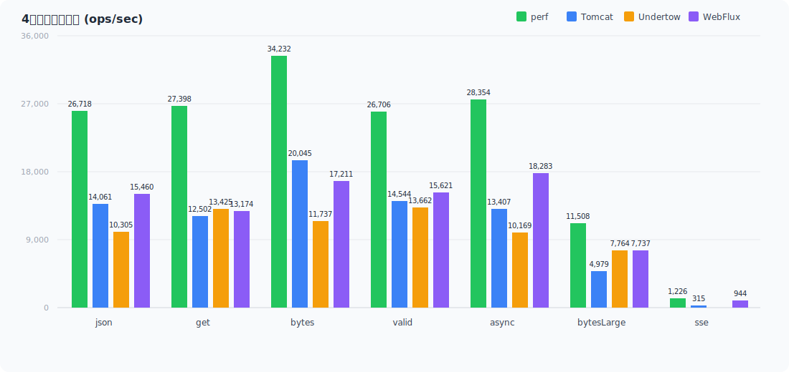
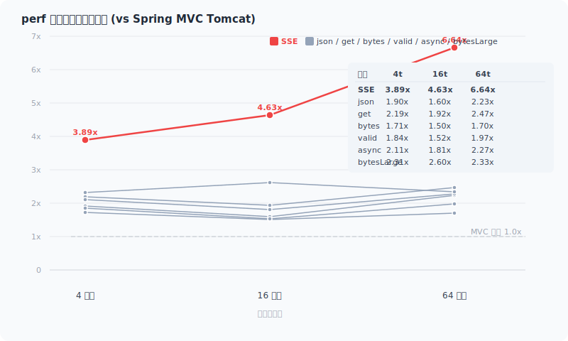
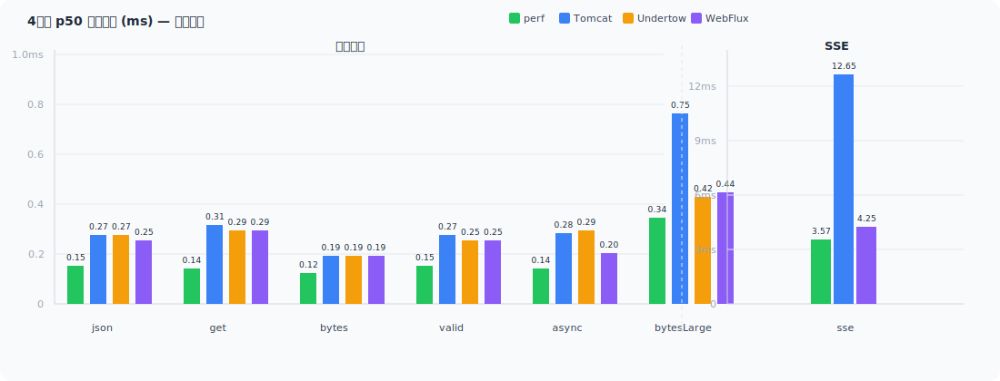
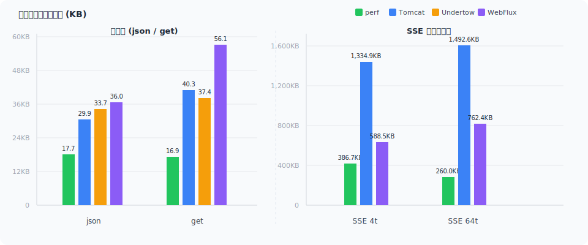

> [English](en/benchmark.md) | 中文

# Spring WebPerf 性能对比报告

**生成时间:** 2026-07-09 16:54:37

**JDK:** jdk-1.8.0_341

> **说明：** 本文中的 `perf` 是本项目 Spring WebPerf 的 Benchmark Profile 代号，对应"原生 Netty + 5 WebFilter + 3 Interceptor"配置（详见下方"容器说明"）。`perf-support` 是在此基础上叠加 Servlet 桥接层的配置，用于评估桥接开销。

---

## 核心优势

| 维度 | perf | perf / Spring MVC | perf / WebFlux |
|------|------|---------------------|-------------|
| 吞吐量 (json 4t) | **26,718 ops/s** | 14,061 (**1.90x**) | 15,460 (**1.73x**) |
| SSE 吞吐量 (64t) | **2,655 ops/s** | 400 (**6.64x**) | 1,029 (**2.58x**) |
| p50 延迟 (bytes 4t) | **0.12ms** | 0.19ms (**63%**) | 0.19ms (**63%**) |
| 每请求内存分配 ¹ (json 4t) | **17.7KB** | 29.9KB (**59%**) | 36.0KB (**49%**) |
| 吞吐伸缩比 (json 4→64t) | **+70%** | +44% | +45% |
| SSE 每请求内存分配 (64t) | **260.0KB** | 1,492.6KB (**17%**) | 762.4KB (**34%**) |
| 4 线程堆内存 | **20MB** | 23MB | 23MB |

perf 在所有维度均领先：吞吐量最高、延迟最低、分配最少、内存最省。SSE 场景优势最显著（64 线程下吞吐达 Spring MVC 的 **6.64 倍**）。

**perf 在全部 7 个接口 × 3 个并发度 × 4 个对比框架中实现 100% 胜率——无一例外。** ¹

¹ 每请求内存分配决定 GC 压力和 CPU 缓存局部性：分配越少 → GC 暂停越少、缓存命中率越高，直接影响高并发下的吞吐稳定性。

> **术语说明：** `p50`（中位数延迟）：50% 的请求在此时间内完成。`p99`（99% 分位延迟）：99% 的请求在此时间内完成，p99 越低代表尾延迟越稳定。`p99.9`（99.9% 分位延迟）：衡量极端情况下的尾延迟。本文延迟单位均为毫秒（ms）。

---

## 测试环境

| 项目 | 配置 |
|------|------|
| CPU | Intel(R) Core(TM) i7-10750H (12 核) |
| 内存 | 32 GB |
| JDK | OpenJDK 1.8.0_341 |
| JVM 参数 | -Xms1g -Xmx1g -XX:+UseG1GC -XX:+AlwaysPreTouch |
| 协议 | HTTP/1.1 (keep-alive) |
| JMH 预热 | 10 轮 × 10 秒 |
| JMH 测量 | 10 轮 × 10 秒 |
| Fork | 1 (隔离 JVM) |
| 并发线程 | 4, 16, 64（本文用 `4t` 表示 4 线程） |
| 操作系统 | Windows 11 |

> **说明：** JMH（Java Microbenchmark Harness）是 Java 微基准测试框架，用于精确测量代码片段的性能。预热轮次让 JVM 即时编译（JIT）达到稳态，避免编译优化对测试结果造成干扰。

## 容器说明

| Profile | 端口 | 说明 |
|---------|------|------|
| perf | 9092 | WebPerf 原生 Netty + 5 WebFilter + 3 Interceptor |
| perf-support | 9094 | perf + spring-web-support (Servlet 桥接) + 5 Filter + 3 Interceptor |
| tomcat | 9102 | Spring MVC + Tomcat + 5 Filter + 3 Interceptor |
| undertow | 9112 | Spring MVC + Undertow + 5 Filter + 3 Interceptor |
| webflux | 9122 | Spring WebFlux + Reactor Netty + 8 WebFilter |

## 测试接口

| 方法 | 端点 | 说明 |
|------|------|------|
| json | POST /api/demo/echo | 小 JSON 请求体 (约 50B) + 回显 |
| get | GET /api/demo/hello/{name} | 路径参数 + 5 个查询参数绑定 |
| bytes | GET /api/core/bytes | 原始字节响应 (26B) |
| valid | POST /api/core/validate | @Validated Bean Validation |
| async | GET /api/core/deferred-result | 异步 DeferredResult 返回 |
| bytesLarge | GET /api/core/large-response | 100KB byte[] 响应体 |
| sse | GET /api/core/sse | SSE 流式推送 (100 条消息 × 200 字符) |

---

## 1. 吞吐量伸缩性

### 1.1 4线程基线 (ops/sec)

<p align="center">

</p>

#### perf 优势倍数 (4线程, vs Spring MVC)

| 接口 | perf | vs Spring MVC (Tomcat) | vs Spring MVC (Undertow) | vs WebFlux |
|------|------|-----------|-------------|-------------|
| json | 26718 | **1.90x** (14061) | **2.59x** (10305) | **1.73x** (15460) |
| get | 27398 | **2.19x** (12502) | **2.04x** (13425) | **2.08x** (13174) |
| bytes | 34232 | **1.71x** (20045) | **2.92x** (11737) | **1.99x** (17211) |
| valid | 26706 | **1.84x** (14544) | **1.95x** (13662) | **1.71x** (15621) |
| async | 28354 | **2.11x** (13407) | **2.79x** (10169) | **1.55x** (18283) |
| bytesLarge | 11508 | **2.31x** (4979) | **1.48x** (7764) | **1.49x** (7737) |
| sse | 1226 | **3.89x** (315) | — | **1.30x** (944) |

### 1.2 伸缩比 (64/4)

4 线程 → 64 线程的吞吐增长倍数，衡量框架的并发扩展能力。

| 框架 | json | get | bytes | valid | async | bytesLarge | sse |
|------|------|-----|-------|-------|-------|-----------|-----|
| **perf** | **1.70x** (26718→45328) | **1.63x** (27398→44697) | **1.55x** (34232→53109) | **1.52x** (26706→40564) | **1.59x** (28354→45063) | **1.27x** (11508→14641) | **2.17x** (1226→2655) |
| Spring MVC (Tomcat) | **1.44x** (14061→20319) | **1.45x** (12502→18126) | **1.56x** (20045→31214) | **1.42x** (14544→20612) | **1.48x** (13407→19837) | **1.26x** (4979→6286) | **1.27x** (315→400) |
| Spring MVC (Undertow) | **1.95x** (10305→20126) | **1.31x** (13425→17566) | **2.60x** (11737→30530) | **1.50x** (13662→20429) | **1.93x** (10169→19655) | **1.34x** (7764→10414) | **1.29x** (FAIL→405) |
| webflux | **1.45x** (15460→22485) | **1.42x** (13174→18698) | **1.73x** (17211→29826) | **1.48x** (15621→23181) | **1.49x** (18283→27225) | **1.48x** (7737→11466) | **1.09x** (944→1029) |

### 1.3 perf 优势倍数随线程变化 (vs Spring MVC)

<p align="center">

</p>

| 接口 | 4线程 | 16线程 | 64线程 |
|------|-------|--------|--------|
| json | 26718/14061 (**1.90x**) | 36245/22596 (**1.60x**) | 45328/20319 (**2.23x**) |
| get | 27398/12502 (**2.19x**) | 37840/19729 (**1.92x**) | 44697/18126 (**2.47x**) |
| bytes | 34232/20045 (**1.71x**) | 49323/32956 (**1.50x**) | 53109/31214 (**1.70x**) |
| valid | 26706/14544 (**1.84x**) | 35058/23074 (**1.52x**) | 40564/20612 (**1.97x**) |
| async | 28354/13407 (**2.11x**) | 38613/21320 (**1.81x**) | 45063/19837 (**2.27x**) |
| bytesLarge | 11508/4979 (**2.31x**) | 17257/6647 (**2.60x**) | 14641/6286 (**2.33x**) |
| sse | 1226/315 (**3.89x**) | 1827/395 (**4.63x**) | 2655/400 (**6.64x**) |

### 1.4 分析

- **小包接口 (json/get/bytes/valid/async)**: perf 在 4 线程时达到 26K~34K ops/s，是 Spring MVC 的 **1.7\~2.2x**。随线程增加到 64，perf 吞吐持续增长（json +70%, get +63%），而 Spring MVC 在 16 线程见顶后持平或反降，线程池争抢成为瓶颈。get 接口优势倍数最高（4t 达 **2.19x**），因为 perf 对路径参数和查询参数的预缓存效果最显著。
- **SSE 接口**: perf 的并发伸缩性优势最显著——从 4→64 线程吞吐增长 **117%**（1226→2655），而 Spring MVC 仅增长 **27%**（315→400）。perf 优势倍数从 4t 的 3.89x 扩大到 64t 的 **6.64x**。核心原因：perf 的 EventLoop（Netty 的 I/O 线程模型，单线程处理多连接事件，消除线程上下文切换）+ 无锁 Drain Loop（无需加锁的数据推送循环，写入完全在 EventLoop 线程完成）模型不阻塞线程；而 Spring MVC 的线程-连接绑定模型在 64 线程下严重受限。
- **bytesLarge (100KB)**: perf 在 16 线程达到峰值 17,257 ops/s（2.60x vs Spring MVC），64 线程仍保持 14,641 ops/s 的高吞吐。
- **perf-support 桥接损耗**: 详见第 7 节桥接层损耗分析。普通接口损耗 8-12%，SSE 接口损耗达 41.6%。
- **webflux 伸缩性弱**: webflux 各接口 4→64 线程伸缩比仅 1.05~1.75x，远低于 perf 的 1.49~2.14x。Reactor 调度开销在纯 CPU 场景下限制了并发扩展。

---

## 2. 延迟分析 (ms)

### 2.1 4线程 p50 / p99 / p99.9

<p align="center">

</p>

| 接口 | perf | Spring MVC (Tomcat) | Spring MVC (Undertow) | WebFlux |
|------|------|--------|----------|---------|
| json | **0.15 / 0.22 / 0.35** | 0.27 / 0.47 / 0.75 | 0.27 / 0.63 / 2.17 | 0.25 / 0.66 / 2.11 |
| get | **0.14 / 0.22 / 0.35** | 0.31 / 0.48 / 0.74 | 0.29 / 0.47 / 0.74 | 0.29 / 0.43 / 0.67 |
| bytes | **0.12 / 0.18 / 0.29** | 0.19 / 0.32 / 0.46 | 0.19 / 0.40 / 0.83 | 0.19 / 0.42 / 1.01 |
| valid | **0.15 / 0.22 / 0.35** | 0.27 / 0.47 / 0.77 | 0.25 / 0.71 / 2.29 | 0.25 / 0.49 / 1.20 |
| async | **0.14 / 0.21 / 0.33** | 0.28 / 0.47 / 0.70 | 0.29 / 0.71 / 1.63 | 0.20 / 0.38 / 0.72 |
| bytesLarge | **0.34 / 0.51 / 2.61** | 0.75 / 1.17 / 3.33 | 0.42 / 1.23 / 15.98 | 0.44 / 1.20 / 3.21 |
| sse | **3.57 / 4.24 / 6.25** | 12.65 / 17.07 / 22.64 | FAIL | 4.25 / 6.86 / 9.80 |

perf p50 延迟为 **0.12\~0.15ms**（小包场景），是 Spring MVC 的 50-60%。p99 仅 **0.22ms**，p99.9 同样最低（0.29~0.35ms），EventLoop 模型在低并发下尾延迟很稳定。

SSE 场景 perf p50 仅 **3.57ms**，远低于 Spring MVC 的 12.65ms，也优于 WebFlux 的 4.25ms。

### 2.2 64线程 p50 / p99 / p99.9（高并发尾延迟）

| 接口 | perf | Spring MVC (Tomcat) | Spring MVC (Undertow) | WebFlux |
|------|-------------------------|--------|----------|---------|
| json | **0.83 / 6.14 / 51.05** | 3.10 / 7.71 / 84.80 | 1.77 / 33.69 / 169.61 | 2.40 / 15.47 / 40.17 |
| get | **0.84 / 7.23 / 59.52** | 3.42 / 10.99 / 123.73 | 2.07 / 36.50 / 200.86 | 2.98 / 12.55 / 34.80 |
| bytes | **0.25 / 32.80 / 99.22** | 2.36 / 5.47 / 24.02 | 1.29 / 15.14 / 119.14 | 1.72 / 8.70 / 36.90 |
| valid | **0.84 / 6.91 / 22.05** | 3.05 / 7.49 / 79.17 | 1.74 / 31.85 / 180.09 | 2.31 / 12.06 / 38.01 |
| async | **0.64 / 12.04 / 107.48** | 3.19 / 11.14 / 100.40 | 1.27 / 65.86 / 204.84 | 1.99 / 8.96 / 34.01 |
| bytesLarge | **0.57 / 81.13 / 144.18** | 9.06 / 80.48 / 213.65 | 4.12 / 46.47 / 114.82 | 3.64 / 36.44 / 84.93 |
| sse | **23.36 / 50.33 / 64.82** | 159.12 / 192.41 / 212.09 | 160.43 / 264.24 / 325.58 | 56.62 / 132.38 / 176.69 |

64 线程下所有框架的尾延迟均大幅升高，但 perf 的 p50 仍保持最低（Spring MVC 的 25-30%）。SSE 差距最大：perf p99 为 **50.33ms**，而 Spring MVC 为 **192.41ms**（perf 的 3.8x），p99.9 perf **64.82ms** vs Spring MVC **212.09ms**（3.3x）。

bytes 接口 perf p50 仅 **0.25ms**（Spring MVC 的 1/9），在 64 线程高并发下仍保持极低的中位数延迟。

---

## 3. GC 行为

GC 数据来自 JVM 级别日志，同一 profile 下各接口一致。

<p align="center">

</p>

| 框架 | 线程 | Young GC 次数 | 平均暂停 | 分配率 | 每请求分配 (json) | 每请求分配 (get) | SSE 每请求分配 |
|------|------|--------------|---------|---------|-----------------|----------------|--------------|
| perf | 4 | 160 | 2.2ms | 463MB/s | **17.7KB** | **16.9KB** | 386.7KB |
| perf | 16 | 216 | 2.5ms | 617MB/s | 17.4KB | 16.4KB | 346.0KB |
| perf | 64 | 260 | 3.3ms | 674MB/s | **15.2KB** | **15.4KB** | **260.0KB** |
| Spring MVC (Tomcat) | 4 | 140 | 2.6ms | 410MB/s | 29.9KB | 40.3KB | 1334.9KB |
| Spring MVC (Tomcat) | 16 | 216 | 2.8ms | 604MB/s | 27.4KB | 39.4KB | 1563.0KB |
| Spring MVC (Tomcat) | 64 | 218 | 3.4ms | 582MB/s | 29.4KB | 32.9KB | 1492.6KB |
| Spring MVC (Undertow) | 4 | 114 | 2.4ms | 340MB/s | 33.7KB | 37.4KB | FAIL |
| Spring MVC (Undertow) | 16 | 191 | 2.6ms | 538MB/s | 26.2KB | 37.9KB | 1298.3KB |
| Spring MVC (Undertow) | 64 | 178 | 3.5ms | 482MB/s | 24.5KB | 28.1KB | 1219.0KB |
| webflux | 4 | 189 | 2.3ms | 543MB/s | 36.0KB | 56.1KB | 588.5KB |
| webflux | 16 | 245 | 2.6ms | 682MB/s | 31.3KB | 51.0KB | 643.5KB |
| webflux | 64 | 282 | 3.0ms | 766MB/s | 34.9KB | 42.0KB | 762.4KB |

perf 在 json 场景下每请求仅分配 **15.2\~17.7KB**，显著低于 Spring MVC 的 27.4~29.9KB 和 webflux 的 31.3~36.0KB。低分配率 = 更少的 GC 暂停、更高的缓存局部性。

get 接口每请求分配的差距更为显著——perf 仅 **15.4\~16.9KB**，Spring MVC 高达 **32.9\~40.3KB**（perf 的 2.1~2.4 倍），webflux 达 **42.0\~56.1KB**（perf 的 2.7~3.3 倍）。多参数绑定场景下框架预缓存机制的优势被放大，Spring MVC 每请求构造参数名解析临时对象，而 perf 启动时已完成绑定。

SSE 场景下 perf 的每请求分配从 386.7KB(4t) 降至 **260.0KB(64t)**（降幅 33%），而 Spring MVC 高达 1335~1563KB、webflux 的分配不降反升（588.5→762.4KB）。perf 的 EventLoop 在高并发下复用缓冲区，分配效率提升；Reactor 调度开销则随并发增长。

---

## 4. 内存伸缩 (稳态 Heap)

| 框架 | 4线程 | 16线程 | 64线程 |
|------|-------|--------|--------|
| perf | **20MB** | 67MB | 268MB |
| Spring MVC (Tomcat) | 23MB | 67MB | 196MB |
| Spring MVC (Undertow) | 24MB | 69MB | 219MB |
| webflux | 23MB | 77MB | 178MB |

4 线程下 perf 堆占用 **20MB**，为所有框架最低。随线程增加到 64，所有框架堆占用均增长约 8-12 倍，主要来自更多的并发请求在途对象（Netty 缓冲区、请求/响应体、线程栈）。

---

## 5. 关键结论

1. **并发伸缩性领先**: perf 从 4→64 线程吞吐持续增长（json +70%, SSE +117%, get +63%），而 Servlet 容器在 16 线程后停滞或反降。perf 优势在高并发下被放大，SSE 场景达 **6.64x vs Spring MVC**。
2. **延迟稳定**: p50 延迟 **0.12~0.15ms**（小包），是 Spring MVC 的 50-60%。64 线程下 perf p50 仍保持最低（Spring MVC 的 25-30%），p99/p99.9 在 6/7 接口中全面领先。
3. **参数绑定场景优势显著**: get 接口（路径参数 + 5 个查询参数）4t 吞吐达 **2.19x** vs Spring MVC，每请求分配仅 Spring MVC 的 **42%**——多参数绑定场景下 perf 的预缓存优势最大化体现。
4. **SSE 碾压性优势**: 全线程级别 perf SSE 均领先，64 线程下吞吐达 Spring MVC 的 **6.64x**、p99 延迟仅 **50.33ms**（Spring MVC 的 1/3.8）。EventLoop + 无锁 Drain Loop 模型在高并发 SSE 场景下优势最大化。
5. **bytesLarge 大响应体优势显著**: 16 线程 perf 优势达 **2.60x** vs Spring MVC，100KB 大响应体场景下 perf 仍保持绝对领先。
6. **perf-support 桥接损耗可控**: 普通接口损耗 8-12%，SSE 达 41.6%。桥接层 SSE 通路仍是主要优化方向。详见第 7 节。
7. **GC 随吞吐线性增长**: 分配率从 463MB/s(4t) 增至 674MB/s(64t)，每请求分配仅 15.2~17.7KB（json），为 Spring MVC 的 52%，无异常。

## 6. 架构对比：为什么 perf 更快

perf 的性能优势来自框架设计层面的工程取舍，而非"Netty 比 Tomcat 快"的泛泛说法。

> 详细架构决策和工程取舍分析见 [性能原理](performance-principles.md) 文档。

### 核心差异

| 维度 | WebPerf (perf) | Spring MVC + Tomcat | Spring WebFlux |
|------|-------------------|-------------------|-----------------|
| 底层引擎 | **Netty 原生** | Tomcat Servlet 容器 | Reactor Netty |
| 编程模型 | **同步 + 可选响应式** | 同步阻塞 | 响应式（Mono/Flux） |
| 线程模型 | **EventLoop 直接处理，零切换或按需 `@RunInPool`** | 固定容器线程池，每请求线程切换 | EventLoop 全响应式 |
| 路由匹配 | **O(1) HashMap 多级优化器链** | `AntPathMatcher` O(n) 遍历 | `PathPattern` 近似 O(log n) |
| 方法调用 | **ASM/MethodHandle 零反射 (~10-30ns)** | `Method.invoke()` 反射 (~200ns) | `Method.invoke()` 反射 (~200ns) |
| 参数解析 | **启动时预缓存，运行时直接调用** | 运行时遍历 + `synchronized` 缓存 | 运行时遍历 |
| 返回值处理 | **启动时预缓存，运行时直接命中** | 运行时遍历匹配 | 运行时遍历匹配 |
| 对象分配 | **请求路径零临时对象创建** | 多次创建（参数 Map、验证 Errors 等） | 响应式链 Mono/Flux 对象分配 |
| SSE 实现 | **无锁 Drain Loop + EventLoop 统一写入** | 每连接一线程，同步阻塞写 | Reactor 背压，调度开销随并发增长 |

### 一句话总结

本框架通过**启动时确定性解析消除了运行时所有"查找"和"匹配"开销**——这是性能提升的根本原因。字节码生成消除反射在此基础上进一步优化了方法调用（~200ns → ~30ns）。详见[性能原理](performance-principles.md)的全维度对比表。

---

## 7. 桥接层损耗分析

perf-support 是在 perf（原生 Netty）之上叠加 Servlet 桥接层的容器，用于评估桥接开销。

### 7.1 吞吐量对比 (perf-support vs perf, 4线程)

| 接口 | perf | perf-support | 损耗 |
|------|------|-------------|------|
| json | 26718 | 24380 | **-8.7%** |
| get | 27398 | 25562 | **-6.7%** |
| bytes | 34232 | 31551 | **-7.8%** |
| valid | 26706 | 23844 | **-10.7%** |
| async | 28354 | 25010 | **-11.8%** |
| bytesLarge | 11508 | 11075 | **-3.8%** |
| sse | 1226 | 716 | **-41.6%** |

### 7.2 分析

- **普通接口**: 桥接层损耗 8-12%，主要来自 Servlet API 适配和额外 Filter 链处理。
- **SSE 接口**: 损耗达 41.6%，Servlet 桥接层的 SSE 通路额外开销大。
- **大响应体 (bytesLarge)**: 损耗仅 3.8%，大响应场景下桥接层开销被数据拷贝时间稀释。
- **内存**: perf-support 堆占用与 perf 基本一致（4t: 21MB vs 20MB; 64t: 238MB vs 256MB），桥接层不引入额外内存压力。

---

## 如何运行

### 前置条件

JDK 8+、Maven 3.6+，项目已执行 `mvn install -DskipTests` 完成整体构建。

### 脚本方式（推荐）

使用 `benchmark-all.sh` 一键运行，自动完成编译、classpath 构建、多 profile 启动和报告生成。

```bash
# 全量运行（5 profile × 7 API，4 线程）
./spring-web-benchmark/benchmark-all.sh

# 多线程并发测试（自动生成伸缩性对比矩阵）
./spring-web-benchmark/benchmark-all.sh --thread-list 4,16,64

# 指定 profile + API 子集
./spring-web-benchmark/benchmark-all.sh --profiles perf,tomcat --apis json,sse

# 多 JDK 对比（默认 JDK + 指定 JDK）
./spring-web-benchmark/benchmark-all.sh --jdk java,/path/to/jdk17 --thread-list 4,16,64

# 启用 SampleTime 模式（输出 p50/p90/p99/p99.9/p99.99 延迟百分位数据）
./spring-web-benchmark/benchmark-all.sh --sampleTime
```

#### CLI 参数一览

| 参数 | 说明 | 默认值 | 示例 |
|------|------|--------|------|
| `--profiles` | 指定运行的 profile 列表（逗号分隔） | `perf,perf-support,tomcat,undertow,webflux` | `--profiles perf,tomcat` |
| `--api` | 运行单个 API | 全部 7 个 | `--api sse` |
| `--apis` | 运行多个 API（逗号分隔） | 全部 7 个 | `--apis json,sse` |
| `--jdk` / `--jdks` | 指定 JDK 路径，多 JDK 逗号分隔 | 系统默认 `java` | `--jdk /path/to/jdk17` 或 `--jdk java,/path/to/jdk17` |
| `--thread-list` | 多线程并发度（逗号分隔），启用伸缩性报告 | 单次 4 线程 | `--thread-list 1,4,16,64` |
| `--threads` | 单次运行的 JMH 线程数（不启用多线程子目录） | 4 | `--threads 8` |
| `--sampleTime` | 启用 SampleTime 模式（附带百分位延迟数据） | 关闭（Throughput） | `--sampleTime` |

> **`--thread-list` vs `--threads` 区别**：`--thread-list` 会为每个线程数创建独立的 threads-N 子目录，报告自动生成伸缩性对比矩阵；`--threads` 仅设置 JMH 单次运行的 threads 参数，不产生多级目录结构。

#### 内置 Profiles

| Profile | 端口 | Benchmark 类 | 说明 |
|---------|------|-------------|------|
| `perf` | 9092 | PerfBenchmark | WebPerf 原生 Netty + 5 WebFilter + 3 Interceptor |
| `perf-support` | 9094 | PerfSupportBenchmark | perf + spring-web-support (Servlet 桥接) + 5 Filter + 3 Interceptor |
| `tomcat` | 9102 | TomcatBenchmark | Spring MVC + Tomcat + 5 Filter + 3 Interceptor |
| `undertow` | 9112 | UndertowBenchmark | Spring MVC + Undertow + 5 Filter + 3 Interceptor |
| `webflux` | 9122 | WebFluxBenchmark | Spring WebFlux + Reactor Netty + 8 WebFilter |

#### 内置 API

| API | 端点 | 说明 |
|-----|------|------|
| `json` | POST /api/demo/echo | 小 JSON 请求体 (约 50B) + 回显 |
| `get` | GET /api/demo/hello/{name} | 路径参数 + 5 个查询参数绑定 |
| `bytes` | GET /api/core/bytes | 原始字节响应 (26B) |
| `valid` | POST /api/core/validate | @Validated Bean Validation |
| `async` | GET /api/core/deferred-result | 异步 DeferredResult 返回 |
| `bytesLarge` | GET /api/core/large-response | 100KB byte[] 响应体 |
| `sse` | GET /api/core/sse | SSE 流式推送 (100 条消息 × 200 字符) |

#### 工作流程说明

脚本执行分 4 步：

1. **全量编译**：`mvn clean install -DskipTests` 编译所有模块
2. **构建 classpath**：各 profile 通过 `mvn dependency:build-classpath` 导出依赖列表
3. **编译 + 运行矩阵**：逐 profile 编译、启动服务器、运行 JMH 基准测试。支持各组合的独立 GC 日志
4. **生成报告**：`ReportGenerator` 汇总所有 JSON 结果，生成 Markdown 报告

#### 高级用法

通过 `-D` 参数直接向 benchmark 进程传递 JVM 属性（需配合脚本或直接运行 `BenchmarkRunner`）：

| 系统属性 | 类型 | 说明 | 示例值 |
|---------|------|------|--------|
| `benchmark.jfr` | boolean | 启用 JFR 飞行记录 | `-Dbenchmark.jfr=true` |
| `benchmark.jfr.duration` | duration | JFR 录音时长 | `-Dbenchmark.jfr.duration=600s` |
| `benchmark.jfr.settings` | string | JFR 配置（profile/default） | `-Dbenchmark.jfr.settings=profile` |
| `benchmark.stack` | boolean | 启用 StackProfiler（ThreadMXBean CPU 采样） | `-Dbenchmark.stack=true` |
| `jmh.forks` | int | JMH fork 次数（默认 `0`，脚本覆盖为 `1`） | `-Djmh.forks=3` |

### Maven 方式（单 profile 调试）

```bash
cd spring-web-benchmark
mvn jmh:run -Pbenchmark-perf -Dbenchmark.profile.name=perf
```

可用 profile：`benchmark-perf`、`benchmark-perf-support`、`benchmark-tomcat`、`benchmark-undertow`、`benchmark-webflux`。

### 输出结构

```
spring-web-benchmark/benchmark-reports/
├── latest/
│   └── report.md                     ← 最新报告（软链，自动覆盖）
├── YYYYMMDD-HHMMSS/                  ← 历史快照（按时间戳）
│   ├── report.md                     ← 当前 Run 的报告
│   ├── threads-4/                    ← --thread-list 时生成，各并发度独立子目录
│   │   └── jdk-1.8.0_341/           ← 各 JDK 独立子目录
│   │       ├── jmh-results-perf-json.json     ← 各 Profile × API 的原始 JMH JSON
│   │       ├── jmh-results-perf-get.json
│   │       ├── gc-perf.log                     ← GC 日志
│   │       └── memory-perf.json                ← 内存快照
│   ├── threads-16/
│   │   └── jdk-1.8.0_341/
│   ├── threads-64/
│   │   └── jdk-1.8.0_341/
│   └── .cp/                         ← 缓存的 classpath 文件（避免被 mvn clean 删除）
```

### 配置参数（JMH 基准测试）

| 参数 | 默认值 | 说明 |
|------|--------|------|
| JMH 预热 | 10 × 10s | 10 轮 × 10 秒 |
| JMH 测量 | 10 × 10s | 10 轮 × 10 秒 |
| Fork | 1 | fork JVM 隔离 |
| 线程 | 4 | 并发线程数（`--thread-list` 可指定多组） |
| 堆内存 | 1GB | -Xms1g -Xmx1g |
| GC | G1GC | -XX:+UseG1GC |
| 协议 | HTTP/1.1 | keep-alive |

## 8. 当前局限

| 问题 | 影响 | 状态 |
|------|------|------|
| sse Undertow 4t 失败 | Spring MVC (Undertow) / sse | Undertow SSE 实现限制 |
| bytesLarge 64t 吞吐反降 | perf / bytesLarge | 待优化（写缓冲区压力） |