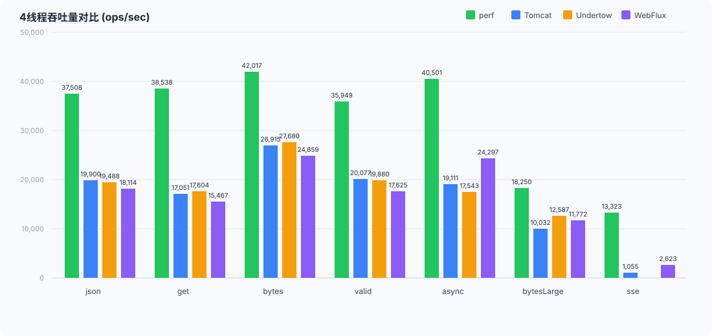
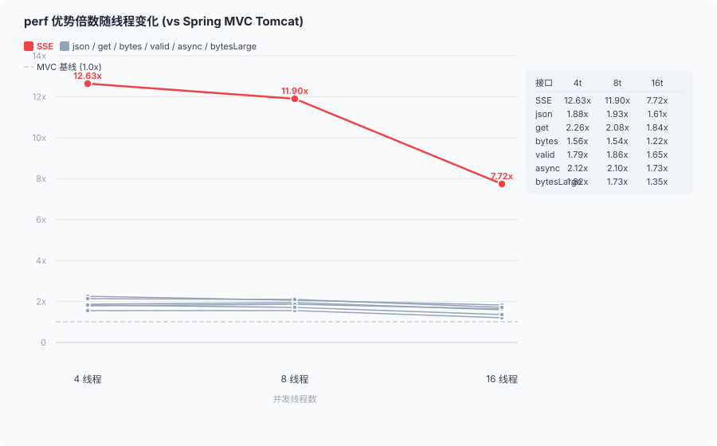
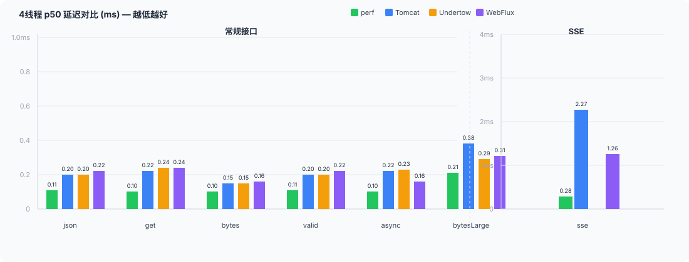
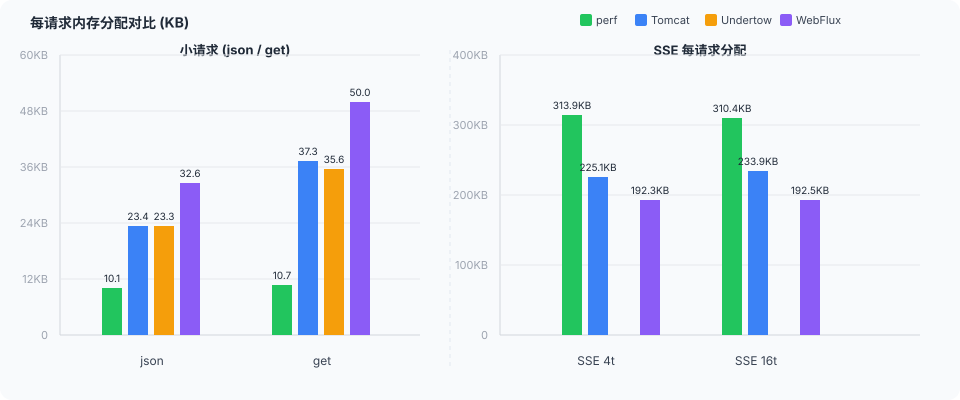

> [English](en/benchmark.md) | 中文

# Spring WebPerf 性能对比报告

**生成时间:** 2026-08-17

**JDK:** jdk-17.0.9

> **说明：** 本文中的 `perf` 是本项目 Spring WebPerf 的 Benchmark Profile 代号，对应"原生 Netty + 5 WebFilter + 3 Interceptor"配置（详见下方"容器说明"）。`perf-support` 是在此基础上叠加 Servlet 桥接层的配置，用于评估桥接开销。
>
> **数据来源：** 吞吐 / 延迟 / GC / 内存均取自 `benchmark-reports/20260814-221509`（thrpt + sample 双模式）。JDK 17.0.9，4/8/16 线程。in-process 模式客户端与服务端共享同一 JVM 的 16 核，档位上限取 ≤ 核数（16t）；更高并发请参考 [benchmark-wsl.md](benchmark-wsl.md)（WSL external，客户端/服务端 CPU 分离）。

---

## 核心优势

| 维度 | perf | perf / Spring MVC | perf / WebFlux |
|------|------|---------------------|-------------|
| 吞吐量 (json 4t) | **37,508 ops/s** | 19,900 (**1.88x**) | 18,114 (**2.07x**) |
| SSE 吞吐量 (16t) | **14,920 ops/s** | 1,933 (**7.72x**) | 4,614 (**3.23x**) |
| p50 延迟 (json 16t) | **0.22ms** | 0.32ms (**69%**) | 0.32ms (**69%**) |
| 每请求内存分配 (json 4t) | **10.1KB** | 23.4KB (**43%**) | 32.6KB (**31%**) |
| 4 线程堆内存 | **24MB** | 26MB | 25MB |

perf 在 7 个接口 × 3 个并发度（4/8/16 线程）对比中，**全部接口、全部并发度第一**（无一例外）。SSE 场景优势最显著（16 线程吞吐达 Spring MVC 的 **7.72 倍**、p50 延迟仅其 **13%**）。

> **伸缩比说明：** perf json 4→16 线程伸缩比 +95%，低于 Spring MVC（+129%）与 WebFlux（+161%）——但这源于 perf 4 线程绝对吞吐已接近饱和（37,508 vs Spring MVC 19,900）、基数高、边际增量小；16 线程绝对吞吐 perf 73,286 仍为 Spring MVC 45,481 的 **1.61 倍**。低伸缩比 ≠ 扩展能力差，绝对吞吐始终第一。

> **术语说明：** `p50`（中位数延迟）：50% 的请求在此时间内完成。`p99`（99% 分位延迟）：99% 的请求在此时间内完成，p99 越低代表尾延迟越稳定。`p99.9`（99.9% 分位延迟）：衡量极端情况下的尾延迟。本文延迟单位均为毫秒（ms）。

---

## 测试环境

| 项目 | 配置 |
|------|------|
| CPU | AMD Ryzen 7 4800U（8 物理核 / 16 逻辑核） |
| 内存 | 16 GB |
| JDK | OpenJDK 17.0.9 |
| JVM 参数 | -Xms1g -Xmx1g -XX:+UseG1GC -XX:+AlwaysPreTouch |
| 协议 | HTTP/1.1 (keep-alive) |
| JMH 预热 | 10 轮 × 10 秒 |
| JMH 测量 | 10 轮 × 10 秒 |
| Fork | 1 (隔离 JVM) |
| 并发线程 | 4, 8, 16（本文用 `4t` 表示 4 线程） |
| 操作系统 | Windows 10（in-process 模式，客户端与服务端同 JVM） |

> **说明：** JMH（Java Microbenchmark Harness）是 Java 微基准测试框架，用于精确测量代码片段的性能。预热轮次让 JVM 即时编译（JIT）达到稳态，避免编译优化对测试结果造成干扰。本文为标准环境（in-process）数据；受限环境（WSL2 4c/2g，服务端 Linux）数据见 [benchmark-wsl.md](benchmark-wsl.md)。
>
> **并发档位选择：** in-process 模式客户端线程与服务端共享 16 核。当客户端线程数超过核数（>16t）时进入超订阅：客户端线程抢走 CPU 份额，轻接口（bytes/async/get）吞吐回落、框架间差距被抹平。因此 in-process 档位上限取 ≤ 核数（4/8/16），高并发公平对比请用 WSL external 模式。

## 容器说明

| Profile | 端口 | 说明 |
|---------|------|------|
| perf | 9092 | WebPerf 原生 Netty + 5 WebFilter + 3 Interceptor |
| perf-support | 9094 | perf + spring-web-support (Servlet 桥接) + 5 Filter + 3 Interceptor |
| tomcat | 9102 | Spring MVC + Tomcat + 5 Filter + 3 Interceptor |
| undertow | 9112 | Spring MVC + Undertow + 5 Filter + 3 Interceptor |
| webflux | 9122 | Spring WebFlux + Reactor Netty + 8 WebFilter |

## 对比框架版本

各对比框架版本取自项目 `spring-boot-dependencies` **3.2.12** BOM 的实际解析结果，与本次测试所用二进制完全一致：

| 框架 | 版本 |
|------|------|
| Spring MVC | **6.1.15**（Spring Framework） |
| Spring WebFlux | **6.1.15**（Spring Framework） |
| Tomcat | **10.1.33**（jakarta.servlet 6.0.0） |
| Undertow | **2.3.17.Final** |
| Reactor Netty | **1.1.24**（reactor-bom 2023.0.12 / reactor-core 3.6.12） |
| Netty | **4.1.115.Final** |
| Jackson | **2.17.2** |
| OkHttp（JMH 客户端） | **4.12.0** |
| JMH | **1.37** |

> **版本来源：** perf 使用原生 Netty（见 [配置](../README_CN.md)），其余四档容器版本由 Spring Boot 3.2.12 依赖管理决定（Spring Framework 6.1.15 → Spring MVC / WebFlux、Tomcat 10.1.33、Undertow 2.3.17.Final、Reactor Netty 1.1.24）；Netty 4.1.115.Final、Jackson 2.17.2、OkHttp 4.12.0 为项目显式覆盖。如需复现，请锁定 `pom.xml` 中的 `spring-boot.version`。

## 测试接口

| 方法 | 端点 | 说明 |
|------|------|------|
| json | POST /api/demo/echo | 小 JSON 请求体 (约 50B) + 回显 |
| get | GET /api/demo/hello/{name} | 路径参数 + 5 个查询参数绑定 |
| bytes | GET /api/core/bytes | 原始字节响应 (26B) |
| valid | POST /api/core/validate | @Validated Bean Validation |
| async | GET /api/core/deferred-result | 异步 DeferredResult 返回 |
| bytesLarge | GET /api/core/large-response | 100KB byte[] 响应体 |
| sse | GET /api/core/sse | SSE 流式推送 (100 条消息 × 200 字符) |

---

## 1. 吞吐量伸缩性

### 1.1 4线程基线 (ops/sec)

<p align="center">

</p>

#### perf 优势倍数 (4线程, vs Spring MVC)

| 接口 | perf | vs Spring MVC (Tomcat) | vs Spring MVC (Undertow) | vs WebFlux |
|------|------|-----------|-------------|-------------|
| json | 37508 | **1.88x** (19900) | **1.92x** (19488) | **2.07x** (18114) |
| get | 38538 | **2.26x** (17051) | **2.19x** (17604) | **2.49x** (15467) |
| bytes | 42017 | **1.56x** (26915) | **1.52x** (27680) | **1.69x** (24859) |
| valid | 35949 | **1.79x** (20077) | **1.81x** (19880) | **2.04x** (17625) |
| async | 40501 | **2.12x** (19111) | **2.31x** (17543) | **1.67x** (24297) |
| bytesLarge | 18250 | **1.82x** (10032) | **1.45x** (12587) | **1.55x** (11772) |
| sse | 13323 | **12.63x** (1055) | — | **5.08x** (2623) |

### 1.2 伸缩比 (16/4)

4 线程 → 16 线程的吞吐增长倍数，衡量框架的并发扩展能力。

| 框架 | json | get | bytes | valid | async | bytesLarge | sse |
|------|------|-----|-------|-------|-------|-----------|-----|
| **perf** | 1.95x (37508→73286) | 1.88x (38538→72636) | 1.77x (42017→74540) | 1.94x (35949→69766) | 1.86x (40501→75134) | 0.85x (18250→15603) | 1.12x (13323→14920) |
| Spring MVC (Tomcat) | 2.29x (19900→45481) | 2.31x (17051→39398) | 2.27x (26915→61042) | 2.11x (20077→42295) | 2.28x (19111→43521) | 1.15x (10032→11555) | 1.83x (1055→1933) |
| Spring MVC (Undertow) | 2.24x (19488→43738) | 2.33x (17604→40972) | 2.16x (27680→59899) | 1.94x (19880→38520) | 2.39x (17543→41905) | 0.85x (12587→10758) | FAIL |
| webflux | 2.61x (18114→47217) | 2.70x (15467→41711) | 2.46x (24859→61181) | 2.67x (17625→47075) | 2.35x (24297→57109) | 0.86x (11772→10087) | 1.76x (2623→4614) |

### 1.3 perf 优势倍数随线程变化 (vs Spring MVC)

<p align="center">

</p>

| 接口 | 4线程 | 8线程 | 16线程 |
|------|-------|--------|--------|
| json | 37508/19900 (**1.88x**) | 54678/28329 (**1.93x**) | 73286/45481 (**1.61x**) |
| get | 38538/17051 (**2.26x**) | 54982/26385 (**2.08x**) | 72636/39398 (**1.84x**) |
| bytes | 42017/26915 (**1.56x**) | 57427/37389 (**1.54x**) | 74540/61042 (**1.22x**) |
| valid | 35949/20077 (**1.79x**) | 52752/28372 (**1.86x**) | 69766/42295 (**1.65x**) |
| async | 40501/19111 (**2.12x**) | 56696/27038 (**2.10x**) | 75134/43521 (**1.73x**) |
| bytesLarge | 18250/10032 (**1.82x**) | 19111/11079 (**1.73x**) | 15603/11555 (**1.35x**) |
| sse | 13323/1055 (**12.63x**) | 15384/1293 (**11.90x**) | 14920/1933 (**7.72x**) |

### 1.4 分析

- **全接口、全并发度第一**：perf 在 7 接口 × 3 并发度（4/8/16）对比中全部第一，无一例外。16t 高并发下优势倍数 1.22x（bytes）~7.72x（sse）。
- **低并发优势倍数最大**：4t 时 json 1.88x、get 2.26x、async 2.12x、sse 12.63x——EventLoop 直接驱动在低并发即与线程池模型拉开差距。
- **16t 倍数回落但绝对领先**：随线程增加 perf 优势倍数略降（json 1.88→1.61x、bytes 1.56→1.22x），因 Tomcat 等线程池框架从 4t 的低利用率追赶；但 16t 绝对吞吐 perf 仍全面领先（json 73,286 vs 45,481）。
- **bytes 全并发度领先**：perf bytes 4t 1.56x、8t 1.54x、16t 74,540 达 Tomcat（61,042）的 **1.22x**，所有档位均第一。
- **bytesLarge 大响应体**：吞吐受 100KB 传输带宽主导，perf 16t 15,603 仍第一（Tomcat 11,555）；所有容器 8→16t 均回落（写缓冲压力）。
- **SSE 碾压性优势**：perf SSE 4t 12.63x、8t 11.90x、16t 7.72x（vs Tomcat）。EventLoop + 无锁 Drain Loop 模型在长连接场景优势最大化。
- **webflux 非全输**：async 场景 webflux 4t 24,297（perf 1.67x）、16t 57,109（perf 1.32x），其响应式模型在异步场景最接近 perf。

---

## 2. 延迟分析 (ms)

### 2.1 4线程 p50 / p99 / p99.9

<p align="center">

</p>

| 接口 | perf | Spring MVC (Tomcat) | Spring MVC (Undertow) | WebFlux |
|------|------|--------|----------|---------|
| json | **0.11 / 0.15 / 0.19** | 0.20 / 0.29 / 0.39 | 0.20 / 0.29 / 0.37 | 0.22 / 0.32 / 0.42 |
| get | **0.10 / 0.15 / 0.18** | 0.22 / 0.33 / 0.46 | 0.24 / 0.34 / 0.43 | 0.24 / 0.37 / 0.50 |
| bytes | **0.10 / 0.14 / 0.17** | 0.15 / 0.21 / 0.28 | 0.15 / 0.20 / 0.25 | 0.16 / 0.23 / 0.30 |
| valid | **0.11 / 0.16 / 0.20** | 0.20 / 0.29 / 0.38 | 0.20 / 0.28 / 0.36 | 0.22 / 0.33 / 0.44 |
| async | **0.10 / 0.14 / 0.18** | 0.22 / 0.32 / 0.43 | 0.23 / 0.32 / 0.39 | 0.16 / 0.24 / 0.31 |
| bytesLarge | **0.21 / 0.35 / 0.76** | 0.38 / 0.57 / 2.76 | 0.29 / 0.48 / 1.70 | 0.31 / 0.54 / 1.68 |
| sse | **0.28 / 0.46 / 3.27** | 2.27 / 6.92 / 8.40 | FAIL | 1.26 / 2.81 / 3.43 |

perf p50 延迟为 **0.10~0.28ms**（小包场景），是 Spring MVC 的 45-67%。p99 最低 **0.14ms**（bytes/async），p99.9 同样全面领先——EventLoop 模型在低并发下尾延迟极稳。

SSE 场景 perf p50 仅 **0.28ms**，是 Spring MVC（2.27ms）的 **12%**，也优于 WebFlux 的 1.26ms。

### 2.2 16线程 p50 / p99 / p99.9（高并发尾延迟）

| 接口 | perf | Spring MVC (Tomcat) | Spring MVC (Undertow) | WebFlux |
|------|-------------------------|--------|----------|---------|
| json | **0.22 / 0.38 / 0.47** | 0.32 / 0.66 / 1.03 | 0.33 / 0.61 / 1.02 | 0.32 / 0.56 / 2.23 |
| get | **0.25 / 0.43 / 0.52** | 0.38 / 0.67 / 2.27 | 0.35 / 0.66 / 2.24 | 0.36 / 0.60 / 2.41 |
| bytes | **0.24 / 0.39 / 0.47** | 0.24 / 0.59 / 0.77 | 0.29 / 0.46 / 0.58 | 0.25 / 0.48 / 0.82 |
| valid | **0.23 / 0.40 / 0.49** | 0.33 / 0.75 / 1.08 | 0.33 / 0.61 / 1.03 | 0.33 / 0.56 / 2.22 |
| async | **0.24 / 0.40 / 0.48** | 0.34 / 0.71 / 2.13 | 0.40 / 0.72 / 2.25 | 0.26 / 0.50 / 1.05 |
| bytesLarge | **1.01 / 2.04 / 3.16** | 1.24 / 2.24 / 4.02 | 1.47 / 2.52 / 3.93 | 1.58 / 2.54 / 3.85 |
| sse | **1.03 / 1.76 / 4.46** | 7.76 / 12.60 / 16.04 | FAIL | 3.34 / 5.75 / 7.37 |

16 线程下 perf **全部 7 个接口 p50 最低**；**json 16t p50 仅 0.22ms，是 Tomcat 的 69%、WebFlux 的 69%**——高吞吐与低延迟同时达成。

> **bytes 16t p50 持平注记**：bytes p50 perf 与 Tomcat 均为 0.24ms，但 perf p99（0.39ms）与 p99.9（0.47ms）明显低于 Tomcat（0.59 / 0.77ms）——中位数持平而尾延迟领先。

SSE 16t：perf p50 1.03ms，仅 Tomcat（7.76ms）的 **13%**；perf p99.9 4.46ms vs Tomcat 16.04ms。

---

## 3. GC 行为

GC 数据来自 JMH GCProfiler（per-API 指标），同一 profile 下各接口独立测量。

<p align="center">

</p>

| 框架 | 线程 | Young GC 次数 | 平均暂停 | 分配率 | 每请求分配 (json) | 每请求分配 (get) | SSE 每请求分配 |
|------|------|--------------|---------|---------|-----------------|----------------|--------------|
| perf | 4 | 61 | 1.3ms | 361MB/s | **10.1KB** | **10.7KB** | 313.9KB |
| perf | 8 | 91 | 1.3ms | 531MB/s | **10.2KB** | **10.7KB** | 312.4KB |
| perf | 16 | 121 | 1.4ms | 707MB/s | **10.1KB** | **10.7KB** | 310.4KB |
| Spring MVC (Tomcat) | 4 | 81 | 7.7ms | 454MB/s | 23.4KB | 37.3KB | 225.1KB |
| Spring MVC (Tomcat) | 8 | 111 | 7.5ms | 641MB/s | 23.2KB | 38.6KB | 219.5KB |
| Spring MVC (Tomcat) | 16 | 184 | 1.5ms | 1054MB/s | 23.8KB | 37.0KB | 233.9KB |
| Spring MVC (Undertow) | 4 | 71 | 1.5ms | 442MB/s | 23.3KB | 35.6KB | FAIL |
| Spring MVC (Undertow) | 8 | 111 | 1.4ms | 655MB/s | 23.5KB | 35.1KB | FAIL |
| Spring MVC (Undertow) | 16 | 171 | 1.6ms | 991MB/s | 23.3KB | 35.4KB | FAIL |
| webflux | 4 | 101 | 1.3ms | 574MB/s | 32.6KB | 50.0KB | 192.3KB |
| webflux | 8 | 151 | 1.4ms | 852MB/s | 32.8KB | 51.8KB | 192.3KB |
| webflux | 16 | 270 | 1.6ms | 1506MB/s | 32.8KB | 51.8KB | 192.5KB |

perf 在 json/get 场景每请求仅分配 **10.1~10.7KB**，是 Spring MVC 的 **43%**（json）、**29%**（get），webflux 的 **31%**（json）、**21%**（get）——预缓存 + 零反射直接体现在分配上。

> **SSE 分配诚实披露**：perf SSE 每请求分配 310~314KB，高于 Tomcat（219~234KB）与 WebFlux（192KB）——perf SSE 吞吐是 Tomcat 的 7.72 倍，每秒处理消息数（每请求 100 条 × 200 字符）远超对方，总量分配随之升高；但 perf SSE 平均暂停仅 1.6~2.4ms（Tomcat SSE 为 3.0~3.6ms），GC 吞吐代价换取的是 **7.72x 的 SSE 吞吐**。分配总量高 ≠ 效率差，需结合吞吐与暂停评估。

---

## 4. 内存伸缩 (稳态 Heap)

容器级稳态快照（同容器所有 API 共享同一 JVM，取 json 场景）：

| 框架 | 4线程 | 8线程 | 16线程 |
|------|-------|--------|--------|
| perf | **24MB** | 37MB | 55MB |
| Spring MVC (Tomcat) | 26MB | 34MB | 58MB |
| Spring MVC (Undertow) | 25MB | 33MB | 53MB |
| webflux | 25MB | 32MB | 51MB |

4 线程下 perf 堆占用 **24MB**，为所有框架最低。随线程增加到 16，各框架堆占用随并发增长（在途请求对象增加）并趋同于 51~58MB——内存优势主要体现在低并发（perf 请求路径零临时对象），高并发下各框架的稳态堆占用接近。

---

## 5. 关键结论

1. **全接口、全并发度第一**：perf 在 7 接口 × 3 并发度（4/8/16）对比中全部第一，无一例外；16t 优势倍数 1.22x~7.72x。
2. **SSE 碾压性优势**：SSE 吞吐 16t 达 **7.72x** vs Spring MVC（14,920 vs 1,933），p50 延迟仅 Tomcat 的 **13%**——EventLoop + 无锁 Drain Loop 在长连接场景优势最大化。
3. **低延迟同步兑现**：json 16t p50 **0.22ms**，仅 Tomcat（0.32ms）的 69%；小包 4t p50 0.10~0.28ms，全面最低。
4. **分配效率**：json/get 每请求分配仅 Spring MVC 的 43%/29%、WebFlux 的 31%/21%，低分配 = 更少 GC 暂停、更高缓存局部性。
5. **内存占用低并发最低**：perf 堆占用 4t 24MB（最低），高并发下各框架趋同。
6. **SSE 分配的取舍**：perf SSE 每请求分配 310~314KB（高于对方），但换来 7.72x 吞吐与 1.6~2.4ms 短暂停（Tomcat SSE 为 3.0~3.6ms）——总量高不等于效率差。

## 6. 架构对比：为什么 perf 更快

perf 的性能优势来自框架设计层面的工程取舍，而非"Netty 比 Tomcat 快"的泛泛说法。

> 详细架构决策和工程取舍分析见 [性能原理](performance-principles.md) 文档。

### 核心差异

| 维度 | WebPerf (perf) | Spring MVC + Tomcat | Spring WebFlux |
|------|-------------------|-------------------|-----------------|
| 底层引擎 | **Netty 原生** | Tomcat Servlet 容器 | Reactor Netty |
| 编程模型 | **同步 + 可选响应式** | 同步阻塞 | 响应式（Mono/Flux） |
| 线程模型 | **EventLoop 直接处理，零切换或按需 `@RunInPool`** | 固定容器线程池，每请求线程切换 | EventLoop 全响应式 |
| 路由匹配 | **O(1) HashMap 多级优化器链** | `AntPathMatcher` O(n) 遍历 | `PathPattern` 近似 O(log n) |
| 方法调用 | **ASM/MethodHandle 零反射 (~10-30ns)** | `Method.invoke()` 反射 (~200ns) | `Method.invoke()` 反射 (~200ns) |
| 参数解析 | **启动时预缓存，运行时直接调用** | 运行时遍历 + `synchronized` 缓存 | 运行时遍历 |
| 返回值处理 | **启动时预缓存，运行时直接命中** | 运行时遍历匹配 | 运行时遍历匹配 |
| 对象分配 | **请求路径零临时对象创建** | 多次创建（参数 Map、验证 Errors 等） | 响应式链 Mono/Flux 对象分配 |
| SSE 实现 | **无锁 Drain Loop + EventLoop 统一写入** | 每连接一线程，同步阻塞写 | Reactor 背压，调度开销随并发增长 |

### 一句话总结

本框架通过**启动时确定性解析消除了运行时所有"查找"和"匹配"开销**——这是性能提升的根本原因。字节码生成消除反射在此基础上进一步优化了方法调用（~200ns → ~30ns）。详见[性能原理](performance-principles.md)的全维度对比表。

---

## 7. 桥接层损耗分析

perf-support 是在 perf（原生 Netty）之上叠加 Servlet 桥接层的容器，用于评估桥接开销。

### 7.1 吞吐量对比 (perf-support vs perf, 4线程)

| 接口 | perf | perf-support | 损耗 |
|------|------|-------------|------|
| json | 37508 | 32942 | **-12.2%** |
| get | 38538 | 32943 | **-14.5%** |
| bytes | 42017 | 38266 | **-8.9%** |
| valid | 35949 | 31694 | **-11.8%** |
| async | 40501 | 33017 | **-18.5%** |
| bytesLarge | 18250 | 17614 | **-3.5%** |
| sse | 13323 | 8632 | **-35.2%** |

### 7.2 分析

- **普通接口**: 桥接层损耗 3-19%，主要来自 Servlet API 适配和额外 Filter 链处理。
- **SSE 接口**: 损耗达 35.2%，Servlet 桥接层的 SSE 通路额外开销大（per 连接桥接成本）。
- **大响应体 (bytesLarge)**: 损耗仅 3.5%，大响应场景下桥接层开销被数据拷贝时间稀释。
- **内存**: perf-support 堆占用与 perf 基本一致（4t: 24MB vs 24MB; 16t: 55MB vs 55MB），桥接层不引入额外内存压力。

---

## 如何运行

> 本框架基准测试有两种运行模式：本页是**模式一（in-process，标准环境）**的数据与操作说明；模式二（WSL external，受限环境）见 [Benchmark 运行指南](benchmark-run.md) 与 [`scripts/WSL_SETUP.md`](../spring-web-benchmark/scripts/WSL_SETUP.md)。

### 前置条件

JDK 17+、Maven 3.6+，项目已执行 `mvn install -DskipTests` 完成整体构建。本报告数据即 JDK 17 生成，同版本（本机 `JAVA_HOME` 指向 17）可复现同口径。

### 脚本方式（推荐）

使用 `benchmark-all.sh` 一键运行，自动完成编译、classpath 构建、多 profile 启动和报告生成。

```bash
# 全量运行（5 profile × 7 API，4 线程）
./spring-web-benchmark/benchmark-all.sh

# 多线程并发测试（自动生成伸缩性对比矩阵）
./spring-web-benchmark/benchmark-all.sh --thread-list 4,8,16

# 指定 profile + API 子集
./spring-web-benchmark/benchmark-all.sh --profiles perf,tomcat --apis json,sse

# 多 JDK 对比（默认 JDK + 指定 JDK）
./spring-web-benchmark/benchmark-all.sh --jdk java,/path/to/jdk17 --thread-list 4,8,16

# 启用 SampleTime 模式（输出 p50/p90/p99/p99.9/p99.99 延迟百分位数据）
./spring-web-benchmark/benchmark-all.sh --sampleTime
```

> **档位建议：** in-process 模式推荐并发档位取 ≤ 机器核数（本文 16 核用 4/8/16）。客户端线程超过核数会进入超订阅，测量退化为"客户端+服务端共享 CPU 的调度效率"，框架间差距被抹平（§8）。更高并发请用 WSL external 模式。

#### CLI 参数一览

| 参数 | 说明 | 默认值 | 示例 |
|------|------|--------|------|
| `--profiles` | 指定运行的 profile 列表（逗号分隔） | `perf,perf-support,tomcat,undertow,webflux` | `--profiles perf,tomcat` |
| `--api` | 运行单个 API | 全部 7 个 | `--api sse` |
| `--apis` | 运行多个 API（逗号分隔） | 全部 7 个 | `--apis json,sse` |
| `--jdk` / `--jdks` | 指定 JDK 路径，多 JDK 逗号分隔 | 系统默认 `java` | `--jdk /path/to/jdk17` 或 `--jdk java,/path/to/jdk17` |
| `--thread-list` | 多线程并发度（逗号分隔），启用伸缩性报告 | 单次 4 线程 | `--thread-list 4,8,16` |
| `--threads` | 单次运行的 JMH 线程数（不启用多线程子目录） | 4 | `--threads 8` |
| `--sampleTime` | 启用 SampleTime 模式（附带百分位延迟数据） | 关闭（Throughput） | `--sampleTime` |

> **`--thread-list` vs `--threads` 区别**：`--thread-list` 会为每个线程数创建独立的 threads-N 子目录，报告自动生成伸缩性对比矩阵；`--threads` 仅设置 JMH 单次运行的 threads 参数，不产生多级目录结构。

#### 内置 Profiles

| Profile | 端口 | Benchmark 类 | 说明 |
|---------|------|-------------|------|
| `perf` | 9092 | PerfBenchmark | WebPerf 原生 Netty + 5 WebFilter + 3 Interceptor |
| `perf-support` | 9094 | PerfSupportBenchmark | perf + spring-web-support (Servlet 桥接) + 5 Filter + 3 Interceptor |
| `tomcat` | 9102 | TomcatBenchmark | Spring MVC + Tomcat + 5 Filter + 3 Interceptor |
| `undertow` | 9112 | UndertowBenchmark | Spring MVC + Undertow + 5 Filter + 3 Interceptor |
| `webflux` | 9122 | WebFluxBenchmark | Spring WebFlux + Reactor Netty + 8 WebFilter |

#### 内置 API

| API | 端点 | 说明 |
|-----|------|------|
| `json` | POST /api/demo/echo | 小 JSON 请求体 (约 50B) + 回显 |
| `get` | GET /api/demo/hello/{name} | 路径参数 + 5 个查询参数绑定 |
| `bytes` | GET /api/core/bytes | 原始字节响应 (26B) |
| `valid` | POST /api/core/validate | @Validated Bean Validation |
| `async` | GET /api/core/deferred-result | 异步 DeferredResult 返回 |
| `bytesLarge` | GET /api/core/large-response | 100KB byte[] 响应体 |
| `sse` | GET /api/core/sse | SSE 流式推送 (100 条消息 × 200 字符) |

#### 工作流程说明

脚本执行分 4 步：

1. **全量编译**：`mvn clean install -DskipTests` 编译所有模块
2. **构建 classpath**：各 profile 通过 `mvn dependency:build-classpath` 导出依赖列表
3. **编译 + 运行矩阵**：逐 profile 编译、启动服务器、运行 JMH 基准测试。支持各组合的独立 GC 日志
4. **生成报告**：`ReportGenerator` 汇总所有 JSON 结果，生成 Markdown 报告

#### 高级用法

通过 `-D` 参数直接向 benchmark 进程传递 JVM 属性（需配合脚本或直接运行 `BenchmarkRunner`）：

| 系统属性 | 类型 | 说明 | 示例值 |
|---------|------|------|--------|
| `benchmark.jfr` | boolean | 启用 JFR 飞行记录 | `-Dbenchmark.jfr=true` |
| `benchmark.jfr.duration` | duration | JFR 录音时长 | `-Dbenchmark.jfr.duration=600s` |
| `benchmark.jfr.settings` | string | JFR 配置（profile/default） | `-Dbenchmark.jfr.settings=profile` |
| `benchmark.stack` | boolean | 启用 StackProfiler（ThreadMXBean CPU 采样） | `-Dbenchmark.stack=true` |
| `jmh.forks` | int | JMH fork 次数（默认 `0`，脚本覆盖为 `1`） | `-Djmh.forks=3` |

### Maven 方式（单 profile 调试）

```bash
cd spring-web-benchmark
mvn jmh:run -Pbenchmark-perf -Dbenchmark.profile.name=perf
```

可用 profile：`benchmark-perf`、`benchmark-perf-support`、`benchmark-tomcat`、`benchmark-undertow`、`benchmark-webflux`。

### 输出结构

```
spring-web-benchmark/benchmark-reports/
├── latest/
│   └── report.md                     ← 最新报告（软链，自动覆盖）
├── YYYYMMDD-HHMMSS/                  ← 历史快照（按时间戳）
│   ├── report.md                     ← 当前 Run 的报告
│   ├── threads-4/                    ← --thread-list 时生成，各并发度独立子目录
│   │   └── jdk-17.0.9/               ← 各 JDK 独立子目录
│   │       ├── jmh-results-perf.json ← 各 Profile 的原始 JMH JSON
│   │       ├── gc-perf.log           ← GC 日志
│   │       └── memory-perf.json      ← 内存快照
│   ├── threads-8/
│   │   └── jdk-17.0.9/
│   ├── threads-16/
│   │   └── jdk-17.0.9/
│   └── .cp/                         ← 缓存的 classpath 文件（避免被 mvn clean 删除）
```

### 配置参数（JMH 基准测试）

| 参数 | 默认值 | 说明 |
|------|--------|------|
| JMH 预热 | 10 × 10s | 10 轮 × 10 秒 |
| JMH 测量 | 10 × 10s | 10 轮 × 10 秒 |
| Fork | 1 | fork JVM 隔离 |
| 线程 | 4 | 并发线程数（`--thread-list` 可指定多组） |
| 堆内存 | 1GB | -Xms1g -Xmx1g |
| GC | G1GC | -XX:+UseG1GC |
| 协议 | HTTP/1.1 | keep-alive |

## 8. 当前局限

| 问题 | 影响 | 状态 |
|------|------|------|
| sse Undertow 失败 | Spring MVC (Undertow) / sse | Undertow SSE 实现限制（4t/8t 全部 FAIL，16t 吞吐可运行但 sample 延迟仍 FAIL） |
| bytesLarge 高并发吞吐反降 | perf / bytesLarge | 100KB 写缓冲压力，所有容器 8→16t 均回落（perf 19,111→15,603），待优化 |
| in-process 高并发超订阅 | 全部 / 高并发 | 客户端线程 > 核数（>16t）时，in-process 测量退化为"客户端+服务端共享 CPU 的调度效率"，轻接口吞吐回落、框架间差距被抹平。这是测量模型限制，非服务端缺陷。已用 JFR 验证：64t 下客户端线程抢占 74% CPU 采样，服务端 4 EventLoop 仅 22%。高并发公平对比请用 [benchmark-wsl.md](benchmark-wsl.md)（WSL external，客户端/服务端 CPU 分离） |
