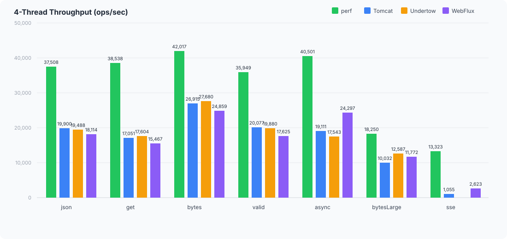
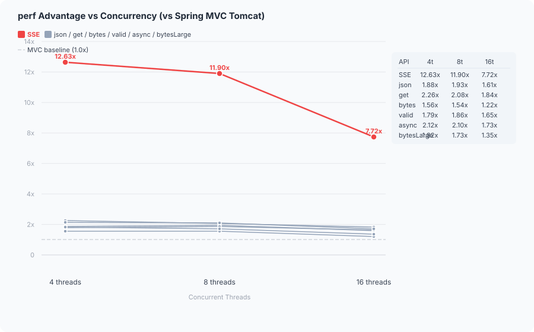
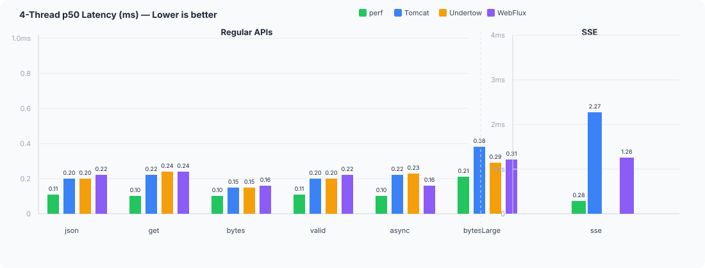
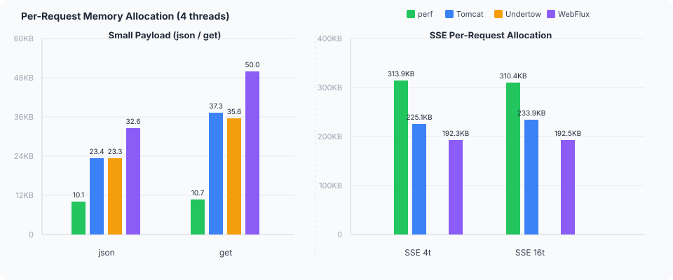

# Spring WebPerf Performance Benchmark Report

**Generated:** 2026-08-17

**JDK:** jdk-17.0.9

> **Note:** `perf` is the benchmark profile for this project's Spring WebPerf — "native Netty + 5 WebFilters + 3 Interceptors" (see *Container Profiles* below). `perf-support` is the same stack plus a Servlet bridge layer, used to measure bridge overhead.
>
> **Data source:** Throughput / latency / GC / memory all from `benchmark-reports/20260814-221509` (thrpt + sample dual mode). JDK 17.0.9, 4/8/16 threads. In-process mode shares a single JVM across 16 cores; the thread ceiling is set at ≤ core count (16t). For higher concurrency see [benchmark-wsl.md](../benchmark-wsl.md) (WSL external — client and server CPUs separated).

---

## Headline Results

| Metric | perf | vs Spring MVC | vs WebFlux |
|--------|------|----------------|------------|
| Throughput (json 4t) | **37,508 ops/s** | 19,900 (**1.88x**) | 18,114 (**2.07x**) |
| SSE throughput (16t) | **14,920 ops/s** | 1,933 (**7.72x**) | 4,614 (**3.23x**) |
| p50 latency (json 16t) | **0.22ms** | 0.32ms (**69%**) | 0.32ms (**69%**) |
| Allocation / request (json 4t) | **10.1KB** | 23.4KB (**43%**) | 32.6KB (**31%**) |
| Heap at 4 threads | **24MB** | 26MB | 25MB |

Across **7 APIs × 3 concurrency levels (4/8/16 threads)**, perf is **#1 on every API at every level** (no exceptions). The most dramatic advantage is SSE: at 16t throughput reaches **7.72x** Spring MVC and p50 latency is only **13%** of Tomcat's.

> **On scaling ratios:** perf's json 4→16 thread scaling is +95%, lower than Spring MVC (+129%) and WebFlux (+161%) — but that is because perf at 4t already runs near saturation (37,508 vs Spring MVC's 19,900): a high base, hence a small marginal gain. In absolute 16t throughput perf still leads 73,286 vs 45,481 (**1.61x**). A lower scaling ratio ≠ weaker scaling; absolute throughput is #1 throughout.

> **Terminology:** `p50` (median latency): 50% of requests complete within this time. `p99` (99th percentile): 99% within — lower p99 = more stable tail. `p99.9` (99.9th percentile): extreme tails. All latency in milliseconds (ms).

---

## Test Environment

| Item | Configuration |
|------|---------------|
| CPU | AMD Ryzen 7 4800U (8 physical / 16 logical cores) |
| Memory | 16 GB |
| JDK | OpenJDK 17.0.9 |
| JVM args | -Xms1g -Xmx1g -XX:+UseG1GC -XX:+AlwaysPreTouch |
| Protocol | HTTP/1.1 (keep-alive) |
| JMH warmup | 10 rounds × 10s |
| JMH measurement | 10 rounds × 10s |
| Fork | 1 (isolated JVM) |
| Concurrency | 4, 8, 16 threads (written `4t` for 4 threads) |
| OS | Windows 10 (in-process mode, client and server share one JVM) |

> **Note:** JMH (Java Microbenchmark Harness) measures code performance precisely; warmup rounds let the JIT reach steady state so compilation doesn't skew results. This document is the standard-environment (in-process) dataset; constrained-environment data (WSL2 4c/2g, Linux server) is in [benchmark-wsl.md](../benchmark-wsl.md).
>
> **Choosing concurrency levels:** in-process mode shares 16 cores between client threads and server. When client threads exceed the core count (>16t), the machine becomes oversubscribed: client threads steal CPU share, light-API throughput drops and gaps between frameworks flatten out. So the in-process ceiling is set at ≤ core count (4/8/16); for a fair high-concurrency comparison use WSL external mode.

## Container Profiles

| Profile | Port | Description |
|---------|------|-------------|
| perf | 9092 | WebPerf native Netty + 5 WebFilters + 3 Interceptors |
| perf-support | 9094 | perf + spring-web-servlet (Servlet bridge) + 5 Filters + 3 Interceptors |
| tomcat | 9102 | Spring MVC + Tomcat + 5 Filters + 3 Interceptors |
| undertow | 9112 | Spring MVC + Undertow + 5 Filters + 3 Interceptors |
| webflux | 9122 | Spring WebFlux + Reactor Netty + 8 WebFilters |

## Framework Versions

Versions below are the actual resolved artifacts from the project's `spring-boot-dependencies` **3.2.12** BOM — identical to the binaries used in this benchmark:

| Framework | Version |
|-----------|---------|
| Spring MVC | **6.1.15** (Spring Framework) |
| Spring WebFlux | **6.1.15** (Spring Framework) |
| Tomcat | **10.1.33** (jakarta.servlet 6.0.0) |
| Undertow | **2.3.17.Final** |
| Reactor Netty | **1.1.24** (reactor-bom 2023.0.12 / reactor-core 3.6.12) |
| Netty | **4.1.115.Final** |
| Jackson | **2.17.2** |
| OkHttp (JMH client) | **4.12.0** |
| JMH | **1.37** |

> **Version source:** perf runs on native Netty (see [configuration](../README.md)); the other four container versions are governed by Spring Boot 3.2.12 dependency management (Spring Framework 6.1.15 → Spring MVC / WebFlux, Tomcat 10.1.33, Undertow 2.3.17.Final, Reactor Netty 1.1.24); Netty 4.1.115.Final, Jackson 2.17.2 and OkHttp 4.12.0 are explicit project overrides. To reproduce, pin `spring-boot.version` in `pom.xml`.

## Benchmarked APIs

| Method | Endpoint | Description |
|--------|----------|-------------|
| json | POST /api/demo/echo | Small JSON body (~50B) + echo |
| get | GET /api/demo/hello/{name} | Path param + 5 query param bindings |
| bytes | GET /api/core/bytes | Raw byte response (26B) |
| valid | POST /api/core/validate | @Validated Bean Validation |
| async | GET /api/core/deferred-result | Async DeferredResult response |
| bytesLarge | GET /api/core/large-response | 100KB byte[] response body |
| sse | GET /api/core/sse | SSE stream (100 messages × 200 chars) |

---

## 1. Throughput Scaling

### 1.1 4-thread baseline (ops/sec)

<p align="center">

</p>

#### perf advantage (4 threads, vs Spring MVC)

| API | perf | vs Spring MVC (Tomcat) | vs Spring MVC (Undertow) | vs WebFlux |
|-----|------|-----------|-------------|-------------|
| json | 37508 | **1.88x** (19900) | **1.92x** (19488) | **2.07x** (18114) |
| get | 38538 | **2.26x** (17051) | **2.19x** (17604) | **2.49x** (15467) |
| bytes | 42017 | **1.56x** (26915) | **1.52x** (27680) | **1.69x** (24859) |
| valid | 35949 | **1.79x** (20077) | **1.81x** (19880) | **2.04x** (17625) |
| async | 40501 | **2.12x** (19111) | **2.31x** (17543) | **1.67x** (24297) |
| bytesLarge | 18250 | **1.82x** (10032) | **1.45x** (12587) | **1.55x** (11772) |
| sse | 13323 | **12.63x** (1055) | — | **5.08x** (2623) |

### 1.2 Scaling ratio (16/4)

Throughput growth from 4 → 16 threads; how well each framework extends under concurrency.

| Framework | json | get | bytes | valid | async | bytesLarge | sse |
|-----------|------|-----|-------|-------|-------|-----------|-----|
| **perf** | 1.95x (37508→73286) | 1.88x (38538→72636) | 1.77x (42017→74540) | 1.94x (35949→69766) | 1.86x (40501→75134) | 0.85x (18250→15603) | 1.12x (13323→14920) |
| Spring MVC (Tomcat) | 2.29x (19900→45481) | 2.31x (17051→39398) | 2.27x (26915→61042) | 2.11x (20077→42295) | 2.28x (19111→43521) | 1.15x (10032→11555) | 1.83x (1055→1933) |
| Spring MVC (Undertow) | 2.24x (19488→43738) | 2.33x (17604→40972) | 2.16x (27680→59899) | 1.94x (19880→38520) | 2.39x (17543→41905) | 0.85x (12587→10758) | FAIL |
| webflux | 2.61x (18114→47217) | 2.70x (15467→41711) | 2.46x (24859→61181) | 2.67x (17625→47075) | 2.35x (24297→57109) | 0.86x (11772→10087) | 1.76x (2623→4614) |

### 1.3 perf advantage vs thread count (vs Spring MVC)

<p align="center">

</p>

| API | 4 threads | 8 threads | 16 threads |
|-----|-----------|-----------|------------|
| json | 37508/19900 (**1.88x**) | 54678/28329 (**1.93x**) | 73286/45481 (**1.61x**) |
| get | 38538/17051 (**2.26x**) | 54982/26385 (**2.08x**) | 72636/39398 (**1.84x**) |
| bytes | 42017/26915 (**1.56x**) | 57427/37389 (**1.54x**) | 74540/61042 (**1.22x**) |
| valid | 35949/20077 (**1.79x**) | 52752/28372 (**1.86x**) | 69766/42295 (**1.65x**) |
| async | 40501/19111 (**2.12x**) | 56696/27038 (**2.10x**) | 75134/43521 (**1.73x**) |
| bytesLarge | 18250/10032 (**1.82x**) | 19111/11079 (**1.73x**) | 15603/11555 (**1.35x**) |
| sse | 13323/1055 (**12.63x**) | 15384/1293 (**11.90x**) | 14920/1933 (**7.72x**) |

### 1.4 Analysis

- **#1 on every API at every level**: perf leads all 7 APIs × 3 concurrency levels (4/8/16) with no exceptions; at 16t the advantage spans 1.22x (bytes) to 7.72x (sse).
- **Biggest multiple at low concurrency**: at 4t json 1.88x, get 2.26x, async 2.12x, sse 12.63x — the EventLoop-driven model pulls ahead of the thread-pool model even at low concurrency.
- **Multiple narrows but stays #1 at 16t**: as threads grow, perf's advantage ratio eases (json 1.88→1.61x, bytes 1.56→1.22x) because pooled frameworks (Tomcat) close some of their 4t under-utilization gap; absolute 16t throughput still leads everywhere (json 73,286 vs 45,481).
- **bytes leads at every level**: perf bytes 1.56x at 4t, 1.54x at 8t, and 74,540 (**1.22x**) Tomcat at 16t — #1 at all three levels.
- **bytesLarge large responses**: throughput is dominated by 100KB transfer bandwidth; perf 16t 15,603 still leads (Tomcat 11,555). All containers dip from 8→16t (write-buffer pressure).
- **SSE is dominant**: perf SSE 4t 12.63x, 8t 11.90x, 16t 7.72x (vs Tomcat). The EventLoop + lock-free Drain Loop model maximizes its advantage on long-lived connections.
- **webflux is not a total loss**: on async, webflux 4t 24,297 (perf 1.67x), 16t 57,109 (perf 1.32x) — its reactive model comes closest to perf on async endpoints.

---

## 2. Latency (ms)

### 2.1 4 threads p50 / p99 / p99.9

<p align="center">

</p>

| API | perf | Spring MVC (Tomcat) | Spring MVC (Undertow) | WebFlux |
|-----|------|--------|----------|---------|
| json | **0.11 / 0.15 / 0.19** | 0.20 / 0.29 / 0.39 | 0.20 / 0.29 / 0.37 | 0.22 / 0.32 / 0.42 |
| get | **0.10 / 0.15 / 0.18** | 0.22 / 0.33 / 0.46 | 0.24 / 0.34 / 0.43 | 0.24 / 0.37 / 0.50 |
| bytes | **0.10 / 0.14 / 0.17** | 0.15 / 0.21 / 0.28 | 0.15 / 0.20 / 0.25 | 0.16 / 0.23 / 0.30 |
| valid | **0.11 / 0.16 / 0.20** | 0.20 / 0.29 / 0.38 | 0.20 / 0.28 / 0.36 | 0.22 / 0.33 / 0.44 |
| async | **0.10 / 0.14 / 0.18** | 0.22 / 0.32 / 0.43 | 0.23 / 0.32 / 0.39 | 0.16 / 0.24 / 0.31 |
| bytesLarge | **0.21 / 0.35 / 0.76** | 0.38 / 0.57 / 2.76 | 0.29 / 0.48 / 1.70 | 0.31 / 0.54 / 1.68 |
| sse | **0.28 / 0.46 / 3.27** | 2.27 / 6.92 / 8.40 | FAIL | 1.26 / 2.81 / 3.43 |

perf p50 is **0.10–0.28ms** (small payloads), 45–67% of Spring MVC. Lowest p99 is **0.14ms** (bytes/async), and p99.9 leads across the board — the EventLoop model keeps tail latency extremely stable at low concurrency.

For SSE, perf p50 is **0.28ms** — only **12%** of Spring MVC (2.27ms) and better than WebFlux (1.26ms).

### 2.2 16 threads p50 / p99 / p99.9 (high-concurrency tail latency)

| API | perf | Spring MVC (Tomcat) | Spring MVC (Undertow) | WebFlux |
|-----|-------------------------|--------|----------|---------|
| json | **0.22 / 0.38 / 0.47** | 0.32 / 0.66 / 1.03 | 0.33 / 0.61 / 1.02 | 0.32 / 0.56 / 2.23 |
| get | **0.25 / 0.43 / 0.52** | 0.38 / 0.67 / 2.27 | 0.35 / 0.66 / 2.24 | 0.36 / 0.60 / 2.41 |
| bytes | **0.24 / 0.39 / 0.47** | 0.24 / 0.59 / 0.77 | 0.29 / 0.46 / 0.58 | 0.25 / 0.48 / 0.82 |
| valid | **0.23 / 0.40 / 0.49** | 0.33 / 0.75 / 1.08 | 0.33 / 0.61 / 1.03 | 0.33 / 0.56 / 2.22 |
| async | **0.24 / 0.40 / 0.48** | 0.34 / 0.71 / 2.13 | 0.40 / 0.72 / 2.25 | 0.26 / 0.50 / 1.05 |
| bytesLarge | **1.01 / 2.04 / 3.16** | 1.24 / 2.24 / 4.02 | 1.47 / 2.52 / 3.93 | 1.58 / 2.54 / 3.85 |
| sse | **1.03 / 1.76 / 4.46** | 7.76 / 12.60 / 16.04 | FAIL | 3.34 / 5.75 / 7.37 |

At 16 threads perf has the **lowest p50 on all 7 APIs**; **json p50 is just 0.22ms — 69% of Tomcat and 69% of WebFlux** — high throughput and low latency achieved simultaneously.

> **bytes 16t p50 parity note**: perf and Tomcat both sit at 0.24ms p50, but perf's p99 (0.39ms) and p99.9 (0.47ms) are clearly below Tomcat's (0.59 / 0.77ms) — equal median, better tail.

SSE at 16t: perf p50 1.03ms — just **13%** of Tomcat (7.76ms); perf p99.9 4.46ms vs Tomcat 16.04ms.

---

## 3. GC Behavior

GC data from JMH GCProfiler (per-API), measured independently per API within each profile.

<p align="center">

</p>

| Framework | Threads | Young GC | Avg pause | Alloc rate | Alloc/req (json) | Alloc/req (get) | SSE alloc/req |
|-----------|---------|----------|-----------|------------|------------------|-----------------|---------------|
| perf | 4 | 61 | 1.3ms | 361MB/s | **10.1KB** | **10.7KB** | 313.9KB |
| perf | 8 | 91 | 1.3ms | 531MB/s | **10.2KB** | **10.7KB** | 312.4KB |
| perf | 16 | 121 | 1.4ms | 707MB/s | **10.1KB** | **10.7KB** | 310.4KB |
| Spring MVC (Tomcat) | 4 | 81 | 7.7ms | 454MB/s | 23.4KB | 37.3KB | 225.1KB |
| Spring MVC (Tomcat) | 8 | 111 | 7.5ms | 641MB/s | 23.2KB | 38.6KB | 219.5KB |
| Spring MVC (Tomcat) | 16 | 184 | 1.5ms | 1054MB/s | 23.8KB | 37.0KB | 233.9KB |
| Spring MVC (Undertow) | 4 | 71 | 1.5ms | 442MB/s | 23.3KB | 35.6KB | FAIL |
| Spring MVC (Undertow) | 8 | 111 | 1.4ms | 655MB/s | 23.5KB | 35.1KB | FAIL |
| Spring MVC (Undertow) | 16 | 171 | 1.6ms | 991MB/s | 23.3KB | 35.4KB | FAIL |
| webflux | 4 | 101 | 1.3ms | 574MB/s | 32.6KB | 50.0KB | 192.3KB |
| webflux | 8 | 151 | 1.4ms | 852MB/s | 32.8KB | 51.8KB | 192.3KB |
| webflux | 16 | 270 | 1.6ms | 1506MB/s | 32.8KB | 51.8KB | 192.5KB |

perf allocates only **10.1–10.7KB/request** on json/get — **43%** of Spring MVC (json), **29%** (get); **31%** of WebFlux (json), **21%** (get). Pre-caching + zero-reflection pay off directly in allocation.

> **Honest note on SSE allocation**: perf allocates 310–314KB/request on SSE, higher than Tomcat (219–234KB) and WebFlux (192KB) — but perf's SSE throughput is 7.72x Tomcat, so far more messages/sec (each request is 100 messages × 200 chars); total allocation rises with it. Yet perf's SSE average pause is just 1.6–2.4ms (Tomcat SSE is 3.0–3.6ms) — the GC cost buys **7.72x SSE throughput**. Higher total allocation ≠ worse efficiency — evaluate against throughput and pause time.

---

## 4. Memory Scaling (steady-state Heap)

Container-level steady-state snapshot (all APIs share one JVM per container; json scenario shown):

| Framework | 4 threads | 8 threads | 16 threads |
|-----------|-----------|-----------|------------|
| perf | **24MB** | 37MB | 55MB |
| Spring MVC (Tomcat) | 26MB | 34MB | 58MB |
| Spring MVC (Undertow) | 25MB | 33MB | 53MB |
| webflux | 25MB | 32MB | 51MB |

At 4 threads perf's heap is **24MB** — the lowest of all frameworks. As threads grow to 16, every framework's heap rises with concurrency (in-flight request objects) and converges to 51–58MB — the memory advantage is most pronounced at low concurrency (perf's request path creates zero throwaway objects), while steady-state heap at high concurrency is comparable across frameworks.

---

## 5. Key Conclusions

1. **#1 on every API at every level**: perf wins all 7 APIs × 3 concurrency levels (4/8/16) with no exceptions; at 16t the advantage spans 1.22x–7.72x.
2. **SSE is dominant**: SSE throughput at 16t is **7.72x** Spring MVC (14,920 vs 1,933); p50 is only **13%** of Tomcat — the EventLoop + lock-free Drain Loop maximizes its edge on long-lived connections.
3. **Low latency, delivered**: json p50 at 16t is **0.22ms** — 69% of Tomcat (0.32ms); small-payload p50 at 4t is 0.10–0.28ms, the lowest across the board.
4. **Allocation efficiency**: json/get per-request allocation is 43%/29% of Spring MVC and 31%/21% of WebFlux — fewer allocations mean fewer GC pauses and better cache locality.
5. **Lowest memory at low concurrency**: perf heap is 24MB at 4t (lowest); frameworks converge at high concurrency.
6. **The SSE allocation trade-off**: perf allocates 310–314KB/request on SSE (higher than peers), but buys 7.72x throughput and 1.6–2.4ms pauses (Tomcat SSE is 3.0–3.6ms) — a higher total is not worse efficiency.

## 6. Architecture: Why perf Is Faster

perf's advantage comes from framework-level engineering trade-offs, not a generic "Netty beats Tomcat" claim.

> For the full architecture decisions and engineering trade-offs, see [performance principles](../performance-principles.md).

### Core differences

| Dimension | WebPerf (perf) | Spring MVC + Tomcat | Spring WebFlux |
|-----------|-------------------|-------------------|-----------------|
| Engine | **Native Netty** | Tomcat Servlet container | Reactor Netty |
| Programming model | **Synchronous + optional reactive** | Synchronous blocking | Reactive (Mono/Flux) |
| Thread model | **EventLoop direct handling, zero hand-off or opt-in `@RunInPool`** | Fixed container pool, thread hand-off per request | Fully reactive EventLoop |
| Route matching | **O(1) HashMap multi-level optimizer chain** | `AntPathMatcher` O(n) scan | `PathPattern` ~O(log n) |
| Method invocation | **ASM/MethodHandle zero-reflection (~10-30ns)** | `Method.invoke()` reflection (~200ns) | `Method.invoke()` reflection (~200ns) |
| Argument resolution | **Pre-cached at startup, direct at runtime** | Runtime scan + `synchronized` cache | Runtime scan |
| Return-value handling | **Pre-cached at startup, direct at runtime** | Runtime scan to match | Runtime scan to match |
| Allocation | **Zero throwaway objects on the request path** | Multiple (param maps, validation Errors, etc.) | Reactive chain Mono/Flux objects |
| SSE | **Lock-free Drain Loop + unified EventLoop write** | One thread per connection, blocking writes | Reactor backpressure, scheduling overhead grows with concurrency |

### One-line summary

This framework eliminates every runtime "lookup" and "match" via **deterministic startup-time resolution** — that is the root cause of the performance gain. Bytecode generation then removes reflection from method invocation on top (~200ns → ~30ns). See [performance principles](../performance-principles.md) for the full comparison table.

---

## 7. Bridge Overhead Analysis

perf-support is perf (native Netty) plus a Servlet bridge layer, used to quantify bridge overhead.

### 7.1 Throughput comparison (perf-support vs perf, 4 threads)

| API | perf | perf-support | Overhead |
|-----|------|-------------|----------|
| json | 37508 | 32942 | **-12.2%** |
| get | 38538 | 32943 | **-14.5%** |
| bytes | 42017 | 38266 | **-8.9%** |
| valid | 35949 | 31694 | **-11.8%** |
| async | 40501 | 33017 | **-18.5%** |
| bytesLarge | 18250 | 17614 | **-3.5%** |
| sse | 13323 | 8632 | **-35.2%** |

### 7.2 Analysis

- **Ordinary APIs**: bridge overhead 3–19%, mostly from Servlet API adaptation and the extra Filter chain.
- **SSE**: overhead reaches 35.2% — the Servlet bridge's SSE path is per-connection expensive.
- **Large responses (bytesLarge)**: only 3.5% — bridge cost is diluted by data-copy time on large responses.
- **Memory**: perf-support heap matches perf (4t: 24MB vs 24MB; 16t: 55MB vs 55MB) — the bridge adds no memory pressure.

---

## How to Run

> This framework's benchmarks run in two modes. This page documents **mode 1 (in-process, standard environment)**; mode 2 (WSL external, constrained environment) is in [Benchmark Run Guide](../benchmark-run.md) and [`scripts/WSL_SETUP.md`](../../spring-web-benchmark/scripts/WSL_SETUP.md).

### Prerequisites

JDK 17+, Maven 3.6+, and a completed `mvn install -DskipTests` build. This report was produced on JDK 17; pointing `JAVA_HOME` at 17 on this machine reproduces the same numbers.

### Script (recommended)

Use `benchmark-all.sh` for a one-shot run: compile, classpath build, multi-profile startup, and report generation.

```bash
# Full run (5 profiles × 7 APIs, 4 threads)
./spring-web-benchmark/benchmark-all.sh

# Multi-thread concurrency test (generates a scaling matrix)
./spring-web-benchmark/benchmark-all.sh --thread-list 4,8,16

# Subset of profiles + APIs
./spring-web-benchmark/benchmark-all.sh --profiles perf,tomcat --apis json,sse

# Multi-JDK comparison (default JDK + specified JDK)
./spring-web-benchmark/benchmark-all.sh --jdk java,/path/to/jdk17 --thread-list 4,8,16

# Enable SampleTime mode (adds p50/p90/p99/p99.9/p99.99 latency percentiles)
./spring-web-benchmark/benchmark-all.sh --sampleTime
```

> **Concurrency levels:** in-process mode recommends thread counts ≤ machine cores (4/8/16 on this 16-core box). Exceeding the core count enters oversubscription, where measurement degrades to "scheduling efficiency of client+server sharing CPU" and flattens framework gaps (§8). For higher concurrency use WSL external mode.

#### CLI reference

| Flag | Description | Default | Example |
|------|-------------|---------|---------|
| `--profiles` | Comma-separated profiles to run | `perf,perf-support,tomcat,undertow,webflux` | `--profiles perf,tomcat` |
| `--api` | Run a single API | all 7 | `--api sse` |
| `--apis` | Run multiple APIs (comma-separated) | all 7 | `--apis json,sse` |
| `--jdk` / `--jdks` | JDK paths, comma-separated for multiple | system `java` | `--jdk /path/to/jdk17` or `--jdk java,/path/to/jdk17` |
| `--thread-list` | Comma-separated concurrency levels; enables the scaling report | single 4-thread run | `--thread-list 4,8,16` |
| `--threads` | JMH threads for a single run (no per-level subdirs) | 4 | `--threads 8` |
| `--sampleTime` | Enable SampleTime mode (adds percentile latency data) | off (Throughput) | `--sampleTime` |

> **`--thread-list` vs `--threads`**: `--thread-list` creates a `threads-N` subdirectory per level and the report auto-generates a scaling matrix; `--threads` only sets JMH's `threads` parameter for a single run.

#### Built-in Profiles

| Profile | Port | Benchmark class | Description |
|---------|------|-----------------|-------------|
| `perf` | 9092 | PerfBenchmark | WebPerf native Netty + 5 WebFilters + 3 Interceptors |
| `perf-support` | 9094 | PerfSupportBenchmark | perf + spring-web-servlet (Servlet bridge) + 5 Filters + 3 Interceptors |
| `tomcat` | 9102 | TomcatBenchmark | Spring MVC + Tomcat + 5 Filters + 3 Interceptors |
| `undertow` | 9112 | UndertowBenchmark | Spring MVC + Undertow + 5 Filters + 3 Interceptors |
| `webflux` | 9122 | WebFluxBenchmark | Spring WebFlux + Reactor Netty + 8 WebFilters |

#### Built-in APIs

| API | Endpoint | Description |
|-----|----------|-------------|
| `json` | POST /api/demo/echo | Small JSON body (~50B) + echo |
| `get` | GET /api/demo/hello/{name} | Path param + 5 query param bindings |
| `bytes` | GET /api/core/bytes | Raw byte response (26B) |
| `valid` | POST /api/core/validate | @Validated Bean Validation |
| `async` | GET /api/core/deferred-result | Async DeferredResult response |
| `bytesLarge` | GET /api/core/large-response | 100KB byte[] response body |
| `sse` | GET /api/core/sse | SSE stream (100 messages × 200 chars) |

#### Workflow

The script runs 4 steps:

1. **Full compile**: `mvn clean install -DskipTests` across all modules
2. **Build classpath**: per-profile `mvn dependency:build-classpath` exports dependency lists
3. **Compile + run matrix**: per profile — compile, start server, run JMH benchmarks; per-combination GC logs
4. **Generate report**: `ReportGenerator` aggregates all JMH JSON into a Markdown report

#### Advanced usage

Pass JVM properties to the benchmark process via `-D` (with the script, or directly running `BenchmarkRunner`):

| System property | Type | Description | Example |
|-----------------|------|-------------|---------|
| `benchmark.jfr` | boolean | Enable JFR flight recording | `-Dbenchmark.jfr=true` |
| `benchmark.jfr.duration` | duration | JFR recording duration | `-Dbenchmark.jfr.duration=600s` |
| `benchmark.jfr.settings` | string | JFR config (profile/default) | `-Dbenchmark.jfr.settings=profile` |
| `benchmark.stack` | boolean | Enable StackProfiler (ThreadMXBean CPU sampling) | `-Dbenchmark.stack=true` |
| `jmh.forks` | int | JMH fork count (default `0`; script overrides to `1`) | `-Djmh.forks=3` |

### Maven (single-profile debugging)

```bash
cd spring-web-benchmark
mvn jmh:run -Pbenchmark-perf -Dbenchmark.profile.name=perf
```

Available profiles: `benchmark-perf`, `benchmark-perf-support`, `benchmark-tomcat`, `benchmark-undertow`, `benchmark-webflux`.

### Output layout

```
spring-web-benchmark/benchmark-reports/
├── latest/
│   └── report.md                     ← latest report (symlink, auto-overwritten)
├── YYYYMMDD-HHMMSS/                  ← historical snapshots (timestamped)
│   ├── report.md                     ← current run's report
│   ├── threads-4/                    ← created with --thread-list; per-level subdirs
│   │   └── jdk-17.0.9/               ← per-JDK subdirs
│   │       ├── jmh-results-perf.json ← raw JMH JSON per profile
│   │       ├── gc-perf.log           ← GC log
│   │       └── memory-perf.json      ← memory snapshot
│   ├── threads-8/
│   │   └── jdk-17.0.9/
│   ├── threads-16/
│   │   └── jdk-17.0.9/
│   └── .cp/                         ← cached classpath files (survive mvn clean)
```

### Benchmark parameters (JMH)

| Parameter | Default | Description |
|-----------|---------|-------------|
| JMH warmup | 10 × 10s | 10 rounds × 10 seconds |
| JMH measurement | 10 × 10s | 10 rounds × 10 seconds |
| Fork | 1 | forked JVM isolation |
| Threads | 4 | concurrency (`--thread-list` for multiple levels) |
| Heap | 1GB | -Xms1g -Xmx1g |
| GC | G1GC | -XX:+UseG1GC |
| Protocol | HTTP/1.1 | keep-alive |

## 8. Known Limitations

| Issue | Impact | Status |
|-------|--------|--------|
| SSE fails on Undertow | Spring MVC (Undertow) / sse | Undertow SSE implementation limitation (4t/8t all FAIL; 16t thrpt ran but sample latency still FAIL) |
| bytesLarge throughput dips at high concurrency | perf / bytesLarge | 100KB write-buffer pressure; every container dips 8→16t (perf 19,111→15,603), TBD |
| In-process oversubscription at high concurrency | all / high concurrency | When client threads exceed core count (>16t), in-process measurement degrades to "scheduling efficiency of client+server sharing CPU": light-API throughput drops and framework gaps flatten. This is a measurement-model limitation, not a server defect. Verified with JFR: at 64t client threads steal 74% of CPU samples, the server's 4 EventLoops get only 22%. For a fair high-concurrency comparison use [benchmark-wsl.md](../benchmark-wsl.md) (WSL external — client/server CPU separated) |
