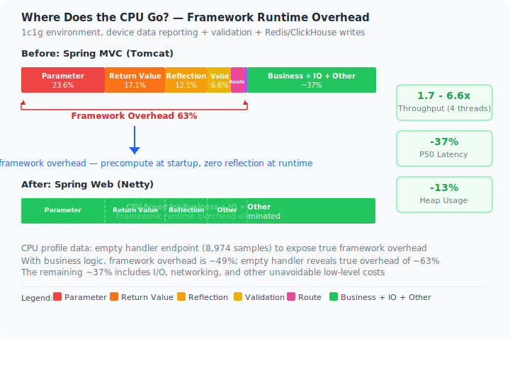
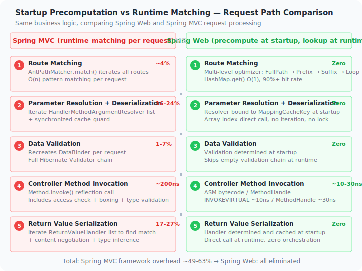

> English | [中文](../overview.md)

# Spring-Perf Web

A high-performance Netty-based web framework compatible with the Spring programming model, designed as a drop-in replacement for Spring MVC.

## Origin

In 2024, I was performance-testing a device data ingestion service at work. The business logic was straightforward: receive device-reported data, validate it, and write to Redis and ClickHouse. The test environment was limited to 1c1g (K8s container limits).

The results were puzzling:

| Transport | TPS |
|-----------|-----|
| Kafka consumer | ~15,000 |
| Spring MVC (Tomcat) | < 4,000 |
| Spring WebFlux | < 4,000 |

Same business logic — only the transport layer changed from a message queue to an HTTP endpoint — yet throughput dropped by **6-7x**. The business logic hadn't changed, so the bottleneck clearly wasn't in the business code.

### Hotspot Analysis

The common characteristic of these overheads: **runtime recomputation instead of startup-time precomputation**. All the information needed is known before a request arrives, yet Spring re-looks-up, re-matches, and re-creates at runtime. This framework resolves all metadata at startup and does only table lookups at runtime — none of the following overheads exist in this project.

#### Spring MVC Runtime Overhead

CPU sampling of a business-logic endpoint (4,170 samples), then CPU sampling of an empty handler (8,974 samples) to exclude business logic dilution — revealing the true framework overhead:

**1. Return Value Serialization Orchestration (17~27%)**

`writeWithMessageConverters` cost isn't in Jackson serialization itself, but in the per-request framework orchestration:

- `selectHandler` (3.95%) — iterates return value handlers to find the right one — this project binds at startup
- `getProducibleMediaTypes` (2.09%) + `sortBySpecificityAndQuality` (0.70%) — content negotiation — this project resolves MediaType at startup
- `getJavaType` → `ObjectMapper.constructType` re-constructs JavaType (0.64%) — this project resolves types at startup
- `canWrite`/`canSerialize` checks (~0.5%) — this project confirms at startup

Actual Jackson bean serialization accounts for only 1.75%. Framework orchestration overhead is **10x higher**. This project has **zero** orchestration overhead.

**2. Argument Resolution & Request Body Deserialization (16~24%)**

`resolveArgument` cost breakdown:

- `readWithMessageConverters` (16.18%) — HTTP body reading and conversion
- `EmptyBodyCheckingHttpInputMessage.<init>` (4.28%) — creates InputStream wrapper per request to check empty body — `Content-Length` alone suffices
- `canRead` (0.97%) — iterates HttpMessageConverter list — this project determines at startup
- `getJavaType` + `GenericTypeResolver.resolveType` (1.2%) — this project completes at startup

**3. Hibernate Validator Chain (1.25~6.61%)**

`validateIfApplicable` is only 1.25% with business logic; the empty handler reveals true overhead at 6.61%:

- `DataBinder.validate` (4.89%) → `SpringValidatorAdapter.validate` (4.60%)
- `ValidatorImpl.validateConstraintsForCurrentGroup` (3.03%)
- `validateMetaConstraint` (1.76%)
- `determineValidationHints` (1.72%)

Each request rebuilds DataBinder and executes the full Hibernate Validator chain. This project determines validation necessity at startup and skips empty validation chains at runtime.

**4. Reflective Method.invoke (0.10~12.08%)**

Empty handler reveals true cost: `doInvoke` (12.19%) → `Method.invoke` (12.08%). With business logic it's only 0.10%, diluted by method execution time. The thinner the business logic, the more glaring reflection overhead becomes. This project uses **zero reflection**.

**5. Route Matching (3.83%)**

- `lookupHandlerMethod` (1.96%) — iterates registered routes
- `addMatchingMappings` (1.51%) — matches each path
- `RequestMappingInfo` re-created each request (0.34%) with hashCode computation
- `PathPattern.matches` (0.30%) + `compareTo` (0.28%)

This project builds the route table at startup and indexes directly at runtime.

| Overhead Category | With Business Logic | Empty Handler | This Project? |
|------------------|-------------------|---------------|---------------|
| Argument resolution + deserialization | 16.47% | 23.61% | None — startup pre-binding |
| Return value serialization orchestration | 26.91% | 17.09% | None — startup pre-binding |
| Validation | 1.25% | 6.61% | None — skips empty validation chain |
| Reflective Method.invoke | 0.10% | 12.08% | None — zero reflection |
| Route matching | 3.84% | 3.83% | None — route table index |
| Content negotiation | 0.70% | ~0.7% | None — resolved at startup |
| **Total** | **~49%** | **~63%** | **None** |

#### Spring WebFlux Runtime Overhead

WebFlux (Netty runtime, 4,173 samples) shares a highly similar pattern with MVC, though with different distribution:

**1. Request Body Deserialization (10.93%)**

- No resolver caching — per-request `supportsParameter` iteration (1.94%) → `getArgumentResolver` (1.82%) + `ConcurrentHashMap` write (0.86%) — MVC has static pre-creation but WebFlux doesn't
- `ResolvableType.forMethodParameter` rebuilt per request (1.39%), 50% heavier than MVC's 0.96%
- `SerializableTypeWrapper` generic resolution chain (2~3%), involving dynamic proxies and reflection
- `extractValidationHints` (1.37%)

**2. Return Value Serialization & Content Negotiation (10.06%)**

- `selectMediaType` (5.32%) — **7x heavier than MVC's content negotiation**, full query of producible types per request
- `getMediaTypesFor` iterates all Encoders (3.38%)
- `EncoderHttpMessageWriter.getWritableMediaTypes` (2.11%) + `canWrite` (0.74%)

**3. Route Matching (3.09%)**

- `getMatchingMapping` (1.80%) + `RequestMappingInfo.getMatchingCondition` (1.80%)
- `RequestMappingInfo.<init>` (0.62%)
- `PathPattern.compareTo` (0.55%)

**4. Reactor Operator Chain Accumulation**

Reactive pipeline scheduling overhead accumulates significantly:

- `InnerOperator.currentContext` recursive propagation ~4%, grows linearly with each pipeline layer
- `MonoZip.subscribe` → `ZipCoordinator.signal` (18%)
- `FluxPeek$PeekSubscriber.onNext` (15.34%)
- `MonoPeekTerminal` series: onSubscribe/request/onNext each 36.9%
- `Operators$MonoSubscriber.complete` subclass dispatch 15~17%
- `FluxMapFuseable.onNext` (36.7%)

This project has **no Reactive stack** — no operator chains, no context propagation, no Peek wrappers.

**5. Netty Protocol Layer (shared)**

This overhead exists in both frameworks:

- `HttpObjectDecoder.readHeaders` (2.40%)
- `DefaultHeaders.add` + validation (validateToken/validateAsciiStringToken ~1.2%)
- `ByteToMessageDecoder.decodeRemovalReentryProtection` (3.67%)

### From Insight to Action

This problem couldn't be solved by switching Servlet containers — switching Tomcat to Undertow or Jetty yields marginal improvement, and WebFlux has similar framework overhead.

What was needed was a **fundamental elimination of framework runtime overhead**.

So I launched the **Spring Performance Engineering** project. Core idea: resolve and match all metadata at startup — runtime only does "table lookups" — zero reflection, zero matching, zero temporary allocation. All while remaining fully compatible with Spring's programming model (`@RequestMapping`, `@RequestParam`, `@RequestBody`, `@ExceptionHandler`, `HandlerInterceptor`, etc.), enabling zero-code migration.

### Results

In JMH benchmarks on JDK 1.8 + G1GC (1GB heap), this framework leads across all 8 scenarios:

- Small-payload throughput **26K~34K** ops/s (4 threads), **1.71x~2.11x** of Spring MVC
- P50 latency **0.12~0.15ms**, approximately **50-60%** of Spring MVC
- Steady-state heap **20MB** (4 threads), approximately **87%** of Spring MVC
- SSE streaming throughput **1,226** ops/s (4 threads), reaching **3.89x** of Spring MVC, scaling to **6.64x** under high concurrency

> Detailed data: [Benchmark Report](benchmark.md). Technical deep-dive: [Performance Principles](performance-principles.md).

---

## Design Philosophy

### 1. Do Everything at Startup, Only Look Up at Runtime

This is the framework's single most important design decision. Traditional web frameworks "find" and "match" on every request — which argument resolver to use, which handler matches the request path, how to write the return value. All of this is knowable before the request arrives, yet frameworks choose to recompute at runtime.

This framework resolves, matches, and caches all metadata at startup (via the `initComponentPhase1/2/3` three-phase lifecycle). At runtime, every component reads directly from array indices — no iteration, no locks, no reflection.

The tradeoff is slightly longer startup time (tens to hundreds of milliseconds), but yields a deterministic execution path for every request.

### 2. Give Control of the Thread Model to the Business

Traditional Servlet containers force all requests through the container thread pool — business code cannot choose where it executes.

This framework allows requests to execute directly on the Netty EventLoop, while providing the `@RunInPool` annotation for method-level control over whether to switch to a business thread pool. Three programming models are freely selectable, with global default controlled by `pool.default-execute-mode` (defaults to the `default` thread pool; set to `eventloop` to switch back to EventLoop):

- **Synchronous blocking (default)**: Without `@RunInPool`, methods execute on the `default` business thread pool, similar to traditional Servlet model; `@RunInPool("custom")` schedules to a custom thread pool
- **EventLoop direct**: `@RunInPool(RunInPool.EVENTLOOP)` executes on EventLoop, suitable for pure CPU-bound work or with reactive drivers (R2DBC, Reactive Redis)
- **Virtual threads**: `@RunInPool(RunInPool.EVENTLOOP)` + JDK 21 virtual threads — non-blocking switching on EventLoop

The framework doesn't make decisions for the user — it provides infrastructure for the user to choose.

### 3. Compatibility First, Not Reinvention

There's no shortage of high-performance web frameworks, but most require business code to use framework-specific APIs (e.g., Vert.x's `Handler<RoutingContext>`, WebFlux's `Mono`/`Flux`).

This framework chose to **directly reuse Spring's annotation system**: `@RequestMapping`, `@RequestParam`, `@RequestBody`, `@PathVariable`, `@Validated`, `@ExceptionHandler`, `HandlerInterceptor`... Migration requires only changing `pom.xml`, not Java code.

### 4. Bridge, Don't Replace — Respect the Ecosystem

The Servlet API has accumulated two decades of ecosystem: Spring Security Filter Chain, `RequestBodyAdvice`, `ResponseBodyAdvice`, countless middleware based on `javax.servlet.Filter`.

This framework doesn't demand "all or nothing." Through the `spring-web-support` bridge module, migration can be gradual: start by running on Netty via the support module reusing existing Filters, then gradually migrate to native `WebFilter`.

---

## When to Use

### Recommended

| Scenario | Reason |
|----------|--------|
| **Resource-constrained environments** (1c1g, 2c2g) | Low framework overhead; 1.6~2.1x throughput of Spring MVC with same resources |
| **High-throughput API services** | 26K~34K ops/s capacity |
| **Latency-sensitive workloads** | P50 0.12~0.15ms, ~50% of Spring MVC |
| **SSE / streaming push** | Lock-free Drain Loop design; 3.89x Spring MVC throughput (4 threads), scaling to 6.64x under high concurrency |
| **Greenfield projects** | Zero migration cost |
| **IoT / device ingestion** | High volume of small requests, resource-constrained — the original use case |

### Use with Caution

| Scenario | Reason |
|----------|--------|
| **Heavily dependent on Servlet API** | Requires `spring-web-support` bridge module; some Servlet API may not be fully compatible |
| **JSP required** | JSP is a Servlet container feature — not supported |
| **Traditional WebSocket** (javax.websocket) | Servlet container WebSocket API not supported |
| **Deep Servlet Filter chains** | Bridge mode adds overhead; migrate to native `WebFilter` gradually |

---

## Feature Coverage

### Supported (ready to use)

| Category | Status |
|----------|--------|
| `@RestController` / `@RequestMapping` | Full (value/path, method, params, headers, consumes, produces) |
| `@RequestParam` / `@PathVariable` / `@RequestHeader` / `@RequestBody` / `@RequestPart` | Full |
| `@ModelAttribute` / `@InitBinder` / `@Validated` | Full |
| `@ExceptionHandler` / `@ControllerAdvice` | Full |
| `@CrossOrigin` | Full (including programmatic CORS registration) |
| `HandlerInterceptor` | Full (including path matching) |
| `DeferredResult` / `Callable` / `StreamEmitter` / `SseEmitter` | Full |
| Reactive Streams (`Publisher`) | Supported (requires reactive-streams dependency) |
| `ResponseEntity` / `HttpEntity` | Full |
| Static resources | Supported |
| File upload (Multipart) | Supported |
| JSON serialization (Jackson / Fastjson 2) | Supported |
| Spring Boot Actuator | Supported (including standalone management port) |
| SSL | Supported |

### Partial (requires bridge module)

| Feature | Notes |
|---------|-------|
| Servlet Filter | Requires `spring-web-support` bridge |
| `RequestBodyAdvice` / `ResponseBodyAdvice` | Requires `spring-web-support` bridge |
| `HttpServletRequest` / `HttpServletResponse` | Requires `spring-web-support` for parameter-level adaptation |
| `ResponseBodyEmitter` | Requires `spring-web-support` |

### Not Supported

| Feature | Reason |
|---------|--------|
| JSP | JSP depends on Servlet container compilation and execution |
| Servlet WebSocket (`javax.websocket`) | Use Netty WebSocket or Spring WebSocket instead |
| `@SessionAttributes` / `@SessionScope` | Session-related features; implement via `WebFilter` if needed |
| Spring MVC `View` / `ViewResolver` | JSP/template rendering scenarios; implement via `ReturnValueResolver` if needed |

---

## Significance in the AI Era

Since 2024, AI large language models have brought two transformations: **how we code** — AI generates code in seconds; **application form** — LLM applications (chat, Agent, RAG) themselves become traffic generators. Both transformations make framework performance optimization even more critical.

### 1. The AI Coding Era

AI coding tools (Copilot, Cursor, Claude Code, etc.) are deeply integrated into daily development. But AI has a clear **boundary** when optimizing performance: it reads business code and analyzes business-level hotspots — loops, SQL, caching. **Framework-level overhead is opaque to AI** — AI doesn't know how many reflective calls or iterations Spring MVC performs per request; it assumes these are "necessary costs." Therefore, AI's performance optimization ceiling is the baseline performance of the underlying framework.

This means: AI can optimize your business layer to the extreme, but if the underlying framework wastes 60% of CPU per request (see [Origin chapter](#origin) hotspot analysis), AI's optimization is locked into the remaining 40%. By eliminating this 60% framework overhead, this framework expands AI's optimization coverage from "40% business layer" to "100% total."

**AI reduces development cost; high-performance frameworks reduce operational cost. The higher the framework baseline, the higher AI's optimization ceiling.**

### 2. SSE Streaming — Core Infrastructure for AI Applications

The core interaction pattern of LLM applications is **streaming output**: tokens generated one by one, pushed in real-time. Whether it's ChatGPT's word-by-word replies, Agent task status streams, or RAG retrieval progress feedback, they all rely on **SSE (Server-Sent Events)** protocol.

However, SSE performs poorly on traditional Servlet containers — Spring MVC's SSE throughput is only ~**315 ops/s** (4 threads), making it a bottleneck in AI application pipelines. This project's SSE throughput reaches **1,226 ops/s**, **3.89x** of Spring MVC, scaling to **6.64x** under high concurrency. This is powered by **NettyStreamSender**'s lock-free Drain Loop design: write operations don't depend on thread pool scheduling, completing batch flushes directly on EventLoop, avoiding the problem of SSE connections occupying threads in traditional Servlet containers.

This means:

- The same server resources can support **4.5x** more concurrent SSE connections
- Lower latency per token push — shorter "time-to-first-token" from the user's perspective
- In AI Gateway, LLM Proxy, streaming inference, and similar scenarios, this framework can replace Nginx/Envoy as a proxy layer, performing high-performance streaming forwarding at the application layer

This project's deep optimization of SSE isn't coincidental — when AI's core protocol matches the framework's design strengths, performance advantages shift from "nice-to-have" to "infrastructure necessity."

### Summary

**AI makes coding faster; high-performance frameworks make code run faster. The two are not alternatives — they multiply each other.**

The AI era needs attention to infrastructure efficiency more than ever — because when code generation is no longer the bottleneck, runtime efficiency is the true ceiling.

---

## Quick Access

- [Quick Start](quickstart.md) — Migrate from Spring MVC to this framework
- [Configuration Reference](configuration.md) — Complete configuration list
- [Module Details](modules.md) — Module responsibilities and internal design
- [Extension Points Guide](extensions.md) — All SPI and customization methods
- [Advanced Topics](advanced.md) — Async, streaming, reactive, performance tuning
- [Benchmark Report](benchmark.md) — Full performance comparison data
- [Performance Principles](performance-principles.md) — Performance optimization deep-dive