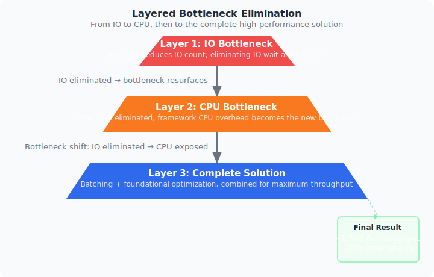
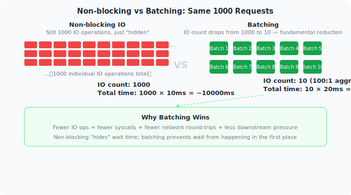
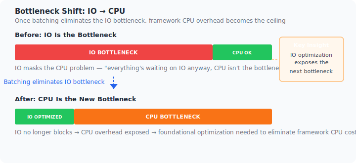
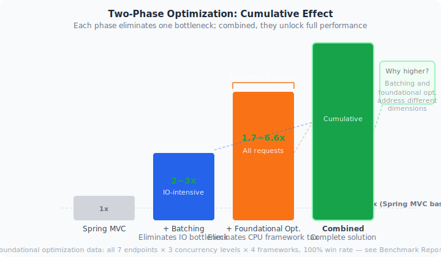

English | [中文](../philosophy.md)

# The Complete Path to High-Performance Java Web

---

## A Puzzling Experiment

In 2024, we ran a simple benchmark — the same business logic (data ingestion → validation → Redis/ClickHouse writes), only the transport layer differed:

| Transport | TPS |
|-----------|-----|
| Kafka consumer | ~15,000 |
| Spring MVC (Tomcat) | < 4,000 |
| Spring WebFlux | < 4,000 |

Kafka was 4x faster than Spring MVC, and WebFlux fared no better. **Identical business code** — the only difference was the HTTP framework overhead.

This raises a straightforward question: if the framework itself can consume 60% of your CPU, where should optimization efforts really be directed?

<p align="center">

</p>

---

## Layer 1: IO Is Not That Simple

### What Problem Does WebFlux Solve?

WebFlux addressed a real problem: Tomcat's thread model struggles under high concurrency. Each request occupies a thread, and too many threads means high context-switching costs and memory pressure.

Its answer is **non-blocking IO** — a thread initiates an IO request and moves on to other work instead of waiting, coming back when data arrives.

Sounds good. But there's a crucial point:

**Non-blocking IO does not reduce the number of IO operations.**

1000 requests needing 1000 database reads — non-blocking IO prevents threads from being blocked on those reads, but it doesn't eliminate a single one. The data still travels from disk to memory, across the network. Physical latency hasn't changed at all.

### Virtual Threads Landed the Second Blow

Java 21's virtual threads weakened WebFlux's core argument. If creating a thread costs about the same as creating a `Mono` object, why learn an entirely new programming paradigm?

Compare the two styles:

**Synchronous code (intuitive):**
```java
@GetMapping("/user/{id}")
public UserResp getUser(@PathVariable Long id) {
    User user = userRepo.findById(id);
    String extra = extraService.get(id);
    return new UserResp(user, extra);
}
```

**Reactive code (requires learning):**
```java
@GetMapping("/user/{id}")
public Mono<UserResp> getUser(@PathVariable Long id) {
    return userRepo.findById(id)
        .zipWith(extraService.get(id))
        .map(tuple -> new UserResp(tuple.getT1(), tuple.getT2()));
}
```

Which one is easier to spot bugs in? The answer is obvious. This isn't about familiarity — **synchronous code executes in the order you read it**, which is how the human brain naturally understands programs.

Virtual threads dramatically improved the concurrency capabilities of the synchronous model, and in doing so, surfaced an uncomfortable question: **Is learning reactive programming worth it, just to go non-blocking?**

### The Real IO Optimization Is Reducing IO

This is the core insight.

The optimal IO strategy isn't "keep the CPU busy while waiting for IO" — it's **making IO happen fewer times**.

```
Non-blocking: 1000 IO ops × 10ms = 10000ms of IO wait
Batching:     10 IO ops  × 20ms = 200ms  of IO wait (100:1 aggregation)
```

Every eliminated IO op saves a syscall, a network round-trip, and pressure on downstream services. These savings are real — not "hidden."

The [`spring-web-batch`](batch.md) module, built on LMAX Disruptor, transparently aggregates concurrent requests into batches. Developers write a handler that accepts a `List`, and the framework handles the rest.

<p align="center">

</p>

---

## Layer 2: After IO, CPU Emerges

### Exposing the Real Bottleneck

Once batching reduces IO pressure, a new bottleneck emerges — CPU.

This isn't accidental; it's an inevitable bottleneck shift. A typical request lifecycle looks like:

```
Request → Route matching → Parameter parsing → Interceptors → Validation → Business logic → Serialization → Response
             ↑                        ↑                                    ↑
          Framework overhead       Framework overhead               Framework overhead
```

When business logic is simple (as it is for most microservices), the framework overhead ratio becomes glaring. This is why the same business logic achieves 15,000 TPS via Kafka (near-zero framework overhead) but is capped at 4,000 under Spring MVC.

### What Exactly Is Spring MVC Spending CPU On?

We ran JFR sampling on an empty handler method. The results speak directly to the question:

- **Content negotiation + serialization orchestration**: 17~27% — not Jackson serialization itself, but `selectHandler`, `getProducibleMediaTypes`, `canWrite` — work repeated on every request
- **Parameter resolution**: 16~24% — resolver matching, `GenericTypeResolver` re-resolving generic types, `EmptyBodyCheckingHttpInputMessage` wrapper creation
- **Validation chain**: 1~7% — validator lookup and matching

These costs share a consistent pattern: **all the information needed was already known before the request arrived, yet the framework recalculates it at runtime.**

> Which URL maps to which method, which parameter resolver is needed, which MediaType to return — all determined at startup. Spring MVC chose a "match at runtime" design, deferring startup-time decisions to every single request.

### "Do It at Startup" Trumps "Optimize It at Runtime"

This project's core idea is simple: **determine everything you can at startup; at runtime, just look up the answer.**

- **Parameter resolvers**: bound per-method at startup, runtime access is `array[cacheIndex]`
- **Return value handlers**: MediaType and handler determined at startup, zero traversal at runtime
- **Routing**: O(1) HashMap lookup, no AntPathMatcher traversal
- **Reflection calls**: replaced by ASM bytecode generation

The result, detailed in [Performance Principles](performance-principles.md): **framework overhead approaches zero.** Every request follows the same runtime path, regardless of its shape.

<p align="center">

</p>

---

## Layer 3: Two Pieces, One Complete Picture

### Not "Or" — "And"

Batching and foundational optimization aren't independent features. They're two phases of the same methodology:

```
              IO Bottleneck              CPU Bottleneck
Phase 1: Batching ──────────────→      exposed
Phase 2:                            Foundational optimization ──→ eliminated
```

Without batching, IO masks the CPU problem. The value of foundational optimization seems small (everything's waiting on IO anyway).

Without foundational optimization, batching eliminates IO — but CPU becomes the new ceiling, and throughput still can't break through.

Only with both does the entire pipeline run clean.

### Programming Model Comparison

| Dimension | WebPerf (this project) | Spring WebFlux | Vert.x |
|-----------|--------------------------|----------------|--------|
| Programming style | Synchronous Spring MVC | Reactive Reactor | Callback/Future |
| Learning curve | Zero | High | Medium-high |
| Code readability | Sequential execution | Chained calls | Callback nesting |
| Virtual threads | Naturally compatible | Diminished value | Naturally compatible |
| Batching support | Built-in (Disruptor) | Must implement | Must implement |

The takeaway: **comparable or better performance + lowest migration cost = where this project sits.**

<p align="center">

</p>

---

## Zero Compromise: Performance Without Sacrificing Developer Experience

By now you might be thinking: "So I need to switch frameworks and rewrite all my code?"

No.

There's a fundamental philosophical difference between this project and "other high-performance solutions":

- **WebFlux** says: Want performance? Learn Reactor.
- **Vert.x** says: Want performance? Write callbacks and futures.
- **WebPerf** says: **Let the framework do the heavy lifting.**

All it takes is one dependency change in your `pom.xml`:

```xml
<!-- Before -->
<dependency>
    <groupId>org.springframework.boot</groupId>
    <artifactId>spring-boot-starter-web</artifactId>
</dependency>

<!-- After -->
<dependency>
    <groupId>io.github.springperf</groupId>
    <artifactId>spring-boot-starter-web</artifactId>
</dependency>
```

Zero code changes. `@RestController` stays `@RestController`, `@RequestMapping` stays `@RequestMapping`, `@Validated` stays `@Validated`.

How is this possible? Because the project was designed from day one to **be compatible with the Spring programming model.** We encapsulated performance complexity inside the framework, not pushed it onto developers. Startup pre-computation, bytecode generation, O(1) routing — these technical details are completely transparent to business code.

**You don't have to choose between "performance" and "developer productivity." You get both.**

---

## Conclusion

Back to the experiment at the start. Kafka was faster because it has virtually no framework overhead — a message arrives, and business logic runs directly.

This project's direction is simple: bring HTTP interfaces to the same level of efficiency. Not by changing languages, programming paradigms, or asking developers to learn new skills — but through engineering:

**First, eliminate the IO bottleneck with batching. Then, eliminate the CPU bottleneck with foundational optimization. Finally, keep the Spring MVC programming model intact.**

This isn't a story about a "replacement." It's a story about evolution.

> - Want the raw performance data? → [Benchmark Report](benchmark.md)
> - Want the optimization technical details? → [Performance Principles](performance-principles.md)
> - Want to use batching? → [Batch Module Docs](batch.md)
> - Want to get started? → [Quick Start](quickstart.md)