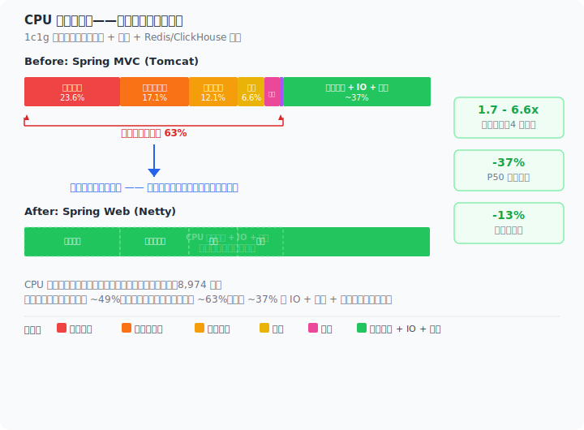
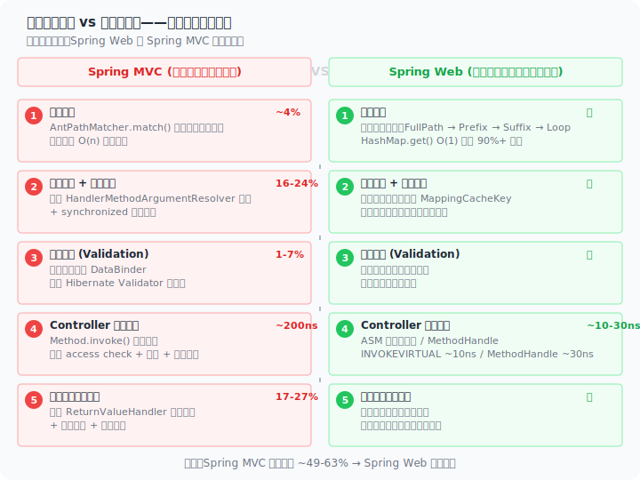

> [English](en/overview.md) | 中文

# Spring WebPerf

基于 Netty 构建的高性能 Web 框架，兼容 Spring MVC 编程模型，零妥协的性能方案。

## 缘起

2024 年，我在工作中对一个设备数据上报服务做性能测试。业务逻辑很简单：接收设备上报的数据，做校验，写入 Redis 和 ClickHouse。测试环境只有 1c1g（K8S容器限制）。

结果令人困惑：

| 接入方式 | TPS     |
|---------|---------|
| Kafka 消费端 | ~15,000 |
| Spring MVC (Tomcat) | < 4,000 |
| Spring WebFlux | < 4,000 |

同样的业务逻辑，只是接入层从消息队列换成了 HTTP 接口，吞吐量就差了 **6-7 倍**。业务逻辑没有变，瓶颈显然不在业务代码里。

### 热点分析

这些开销的共同特征：**运行时重计算而非启动时预计算**。信息在请求到达前就已确定，但 Spring 在运行时重新查找、匹配、创建。本项目在启动阶段完成所有元数据解析和匹配，运行时只做查表，以下每项开销在本项目中均不存在。

#### Spring MVC 运行时开销

对包含业务逻辑的接口做 CPU 采样（4,170 样本），再对空方法接口做 CPU 采样（8,974 样本）排除业务逻辑稀释，得到框架层的真实开销分布：

**1. 返回值序列化编排（17~27%）**

`writeWithMessageConverters` 的消耗主要不在 Jackson 序列化本身，而在每次请求的框架编排：

- `selectHandler`（3.95%）遍历返回值处理器列表匹配正确的处理器——本项目启动时直接绑定
- `getProducibleMediaTypes`（2.09%）+ `sortBySpecificityAndQuality`（0.70%）内容协商——本项目启动时确定 MediaType
- `getJavaType` → `ObjectMapper.constructType` 重新构造 JavaType（0.64%）——本项目启动时完成类型解析
- `canWrite`/`canSerialize` 检查（~0.5%）——本项目启动时确认

Jackson 实际的 Bean 序列化仅占 1.75%，框架编排开销是其 10 倍以上。本项目编排层为 **零**。

**2. 参数解析与请求体反序列化（16~24%）**

`resolveArgument` 的消耗分布：

- `readWithMessageConverters`（16.18%）——HTTP 消息体读取与转换
- `EmptyBodyCheckingHttpInputMessage.<init>`（4.28%）——每请求创建 InputStream 包装器检查空体，`Content-Length` 即可直接判断
- `canRead`（0.97%）遍历 HttpMessageConverter 列表——本项目启动时确定
- `getJavaType` + `GenericTypeResolver.resolveType`（1.2%）——本项目启动时完成

**3. Hibernate Validator 校验链（1.25~6.61%）**

`validateIfApplicable` 在有业务逻辑时仅 1.25%，空处理暴露真实开销 6.61%：

- `DataBinder.validate`（4.89%）→ `SpringValidatorAdapter.validate`（4.60%）
- `ValidatorImpl.validateConstraintsForCurrentGroup`（3.03%）
- `validateMetaConstraint`（1.76%）
- `determineValidationHints`（1.72%）

每次请求重建 DataBinder、执行完整 Hibernate Validator 校验链。本项目在启动时确定是否需要校验，运行时跳过空校验链。

**4. 反射调用 Method.invoke（0.10~12.08%）**

空处理暴露其真实开销：`doInvoke`（12.19%）→ `Method.invoke`（12.08%）。有业务逻辑时仅 0.10%，因为被业务方法执行时间稀释。业务逻辑越薄，反射开销越刺眼。本项目零反射。

**5. 路由匹配（3.83%）**

- `lookupHandlerMethod`（1.96%）遍历已注册路由
- `addMatchingMappings`（1.51%）逐一路径匹配
- `RequestMappingInfo` 每次创建新实例（0.34%）并计算 hashCode
- `PathPattern.matches`（0.30%）+ `compareTo`（0.28%）

本项目启动时构建路由表，运行时直接索引。

| 开销类别 | 有业务逻辑占比 | 空处理占比 | 本项目是否有此开销 |
|---------|-------------|-----------|----------------|
| 参数解析 + 反序列化 | 16.47% | 23.61% | 无——启动预绑定 |
| 返回值序列化编排 | 26.91% | 17.09% | 无——启动预绑定 |
| Validation | 1.25% | 6.61% | 无——跳过空校验链 |
| 反射 Method.invoke | 0.10% | 12.08% | 无——零反射 |
| 路由匹配 | 3.84% | 3.83% | 无——路由表索引 |
| 内容协商 | 0.70% | ~0.7% | 无——启动时确定 |
| **合计** | **~49%** | **~63%** | **均无** |

#### Spring WebFlux 运行时开销

WebFlux（Netty 运行时，4,173 样本）与 MVC 问题模式高度相似，比例分布不同：

**1. 请求体反序列化（10.93%）**

- 解析器匹配无缓存——每请求遍历 `supportsParameter`（1.94%）→ `getArgumentResolver`（1.82%）+ `ConcurrentHashMap` 写入（0.86%）——MVC 有静态预创建但 WebFlux 没有
- `ResolvableType.forMethodParameter` 每请求重建（1.39%），比 MVC 的 0.96% 重 50%
- `SerializableTypeWrapper` 泛型解析链（2~3%），涉及动态代理和反射
- `extractValidationHints`（1.37%）

**2. 返回值序列化与内容协商（10.06%）**

- `selectMediaType`（5.32%）——**比 MVC 的内容协商重 7 倍**，每请求完整查询可生产类型
- `getMediaTypesFor` 遍历所有 Encoder（3.38%）
- `EncoderHttpMessageWriter.getWritableMediaTypes`（2.11%）+ `canWrite`（0.74%）

**3. 路由匹配（3.09%）**

- `getMatchingMapping`（1.80%）+ `RequestMappingInfo.getMatchingCondition`（1.80%）
- `RequestMappingInfo.<init>`（0.62%）
- `PathPattern.compareTo`（0.55%）

**4. Reactor operator 链积少成多**

响应式流水线的调度开销累计显著：

- `InnerOperator.currentContext` 递归传播 ~4%，链路每增一层线性增长
- `MonoZip.subscribe` → `ZipCoordinator.signal`（18%）
- `FluxPeek$PeekSubscriber.onNext`（15.34%）
- `MonoPeekTerminal` 系列 onSubscribe/request/onNext 各 36.9%
- `Operators$MonoSubscriber.complete` 子类分发 15~17%
- `FluxMapFuseable.onNext`（36.7%）

本项目**无 Reactive 栈**，无 operator 链、无上下文传播、无 Peek 包装。

**5. Netty 协议层（双方共有）**

这部分开销双方均有：

- `HttpObjectDecoder.readHeaders`（2.40%）
- `DefaultHeaders.add` + 校验（validateToken/validateAsciiStringToken ~1.2%）
- `ByteToMessageDecoder.decodeRemovalReentryProtection`（3.67%）

### 从洞察到行动

这个问题不是换个 Servlet 容器能解决的——Tomcat 换成 Undertow 或 Jetty 改善有限，WebFlux 也有类似的框架开销。

需要的是一个**从根本上消除框架运行时开销**的方案。

于是我启动了 **Spring Performance Engineering** 项目。核心思想：在启动阶段完成所有元数据的解析和匹配，运行时只做"查表"操作——零反射、零匹配、零临时分配。同时完全兼容 Spring 的编程模型（`@RequestMapping`、`@RequestParam`、`@RequestBody`、`@ExceptionHandler`、`HandlerInterceptor` 等），让业务代码零侵入迁移。

### 成果

在 JDK 1.8 + G1GC (1GB heap) 的基准测试中，本框架在 8 个场景下全面领先：

- 小包场景吞吐 **26K\~34K** ops/s（4 线程），是 Spring MVC 的 **1.71x\~2.11x**
- P50 延迟 **0.12~0.15ms**，约为 Spring MVC 的 **50-60%**
- 稳态堆占用 **20MB**（4 线程），约为 Spring MVC 的 **87%**
- SSE 流式场景吞吐 **1,226** ops/s（4 线程），达到 Spring MVC 的 **3.89x**，高并发下扩展至 **6.64x**

> 详细数据见 [Benchmark 报告](benchmark.md)，技术原理见 [性能原理](performance-principles.md)。

---

## 设计哲学

### 1. 启动时做所有事，运行时只查表

这是整个框架最核心的设计决策。传统 Web 框架在每次请求到达时都要做"查找"和"匹配"——参数需要用哪个解析器、请求路径对应哪个处理器、返回值用什么方式写出。这些信息在请求到达之前就是确定的，但框架选择在运行时重新计算。

本框架在启动时（`initComponentPhase1/2/3` 三阶段生命周期）完成所有元数据的解析、匹配和缓存。运行时每个组件直接从数组索引取值，没有遍历、没有锁、没有反射。

代价是启动时间略长（多几十到几百毫秒），但换来了每次请求的确定性执行路径。

### 2. 把线程模型的选择权交给业务

传统 Servlet 容器强制将所有请求交给容器线程池处理，业务代码无法选择在哪里执行。

本框架允许请求直接在 Netty EventLoop 上执行，同时提供 `@RunInPool` 注解让业务方按方法粒度决定是否需要切换到业务线程池。三种编程模型自由选择，全局默认行为由 `pool.default-execute-mode` 控制（默认 `default` 线程池，设 `eventloop` 可切回 EventLoop）：

- **同步阻塞（默认）**：无 `@RunInPool` 时方法默认在 `default` 业务线程池执行，和传统 Servlet 模型类似；`@RunInPool("custom")` 可调度到自定义线程池
- **EventLoop 直处理**：`@RunInPool(RunInPool.EVENTLOOP)` 在 EventLoop 上执行，适合纯 CPU 计算或配合响应式驱动（R2DBC、Reactive Redis）
- **虚拟线程**：`@RunInPool(RunInPool.EVENTLOOP)` + JDK 21 虚拟线程，EventLoop 上无阻塞切换

框架不替用户做决定，而是提供基础设施让用户自行选择。

### 3. 兼容优先，而非另起炉灶

市面上不缺高性能 Web 框架，但大多数要求业务代码使用框架特有的 API（如 Vert.x 的 `Handler<RoutingContext>`、WebFlux 的 `Mono`/`Flux`）。

本框架选择**直接复用 Spring 注解体系**：`@RequestMapping`、`@RequestParam`、`@RequestBody`、`@PathVariable`、`@Validated`、`@ExceptionHandler`、`HandlerInterceptor`……迁移只需要改 pom.xml，不需要改 Java 代码。

### 4. 桥接而非替代——尊重生态

Servlet API 有二十年的生态积累：Spring Security Filter Chain、`RequestBodyAdvice`、`ResponseBodyAdvice`、大量基于 `javax.servlet.Filter` 的中间件。

本框架不强制"全要或全不要"。通过 `spring-web-support` 桥接模块，可以渐进式迁移：项目先用 support 模块运行在 Netty 上复用现有 Filter，再逐步迁移到原生 WebFilter。

---

## 适用场景

### 推荐使用

| 场景 | 理由 |
|------|------|
| **资源受限环境**（1c1g、2c2g） | 框架开销低，同等资源下吞吐是 Spring MVC 的 1.6~2.1x |
| **高吞吐 API 服务** | 26K~34K ops/s 的吞吐能力，适合接口层卸载 |
| **延迟敏感业务** | P50 0.12~0.15ms，是 Spring MVC 的 50% |
| **SSE / 流式推送** | 无锁 Drain Loop 设计，吞吐达 Spring MVC 的 3.89x（4 线程），高并发下扩展至 6.64x |
| **新启动的项目** | 从零开始的项目可以直接选用，无需迁移成本 |
| **IoT / 设备接入** | 大量小请求、资源受限的典型场景（也是本项目缘起的场景） |

### 谨慎使用

| 场景 | 原因 |
|------|------|
| **重度依赖 Servlet API** | 需要引入 `spring-web-support` 桥接模块，部分 Servlet API 可能不完全兼容 |
| **需要使用 JSP** | JSP 是 Servlet 容器特性，不支持 |
| **传统 WebSocket**（javax.websocket） | 不支持 Servlet 容器的 WebSocket API |
| **深度的 Servlet Filter 链** | 桥接模式会增加额外开销，建议逐步迁移到原生 WebFilter |

---

## 功能覆盖度

### 已支持（可直接使用）

| 类别 | 支持情况 |
|------|---------|
| `@RestController` / `@RequestMapping` | 全支持（value/path、method、params、headers、consumes、produces） |
| `@RequestParam` / `@PathVariable` / `@RequestHeader` / `@RequestBody` / `@RequestPart` | 全支持 |
| `@ModelAttribute` / `@InitBinder` / `@Validated` | 全支持 |
| `@ExceptionHandler` / `@ControllerAdvice` | 全支持 |
| `@CrossOrigin` | 全支持（含编程式 CORS 注册） |
| `HandlerInterceptor` | 全支持（含路径匹配） |
| `DeferredResult` / `Callable` / `StreamEmitter` / `SseEmitter` | 全支持 |
| Reactive Streams（`Publisher`） | 支持（需添加 reactive-streams 依赖） |
| `ResponseEntity` / `HttpEntity` | 全支持 |
| 静态资源处理 | 支持 |
| 文件上传（Multipart） | 支持 |
| JSON 序列化（Jackson / Fastjson 2） | 支持 |
| Spring Boot Actuator | 支持（含独立管理端口） |
| SSL | 支持 |

### 部分支持（需桥接模块）

| 功能 | 说明 |
|------|------|
| Servlet Filter | 需 `spring-web-support` 模块桥接 |
| `RequestBodyAdvice` / `ResponseBodyAdvice` | 需 `spring-web-support` 模块桥接 |
| `HttpServletRequest` / `HttpServletResponse` | 需 `spring-web-support` 模块，提供参数级适配 |
| `ResponseBodyEmitter` | 需 `spring-web-support` 模块 |

### 不支持

| 功能 | 原因 |
|------|------|
| JSP | JSP 依赖 Servlet 容器编译和执行，不支持 |
| Servlet WebSocket（`javax.websocket`） | 需使用 Netty WebSocket 或 Spring WebSocket |
| `@SessionAttributes` / `@SessionScope` | 与 Session 相关的功能，如需可基于 `WebFilter` 自行实现 |
| Spring MVC `View` / `ViewResolver` | JSP/模板渲染场景，如需可基于 `ReturnValueResolver` 自行实现 |

---

## 在 AI 大模型时代的意义

2024 年以来，AI 大模型带来了两重变革：**编程方式**——AI 秒级生成代码；**应用形态**——大模型应用（对话、Agent、RAG）本身成为流量主力。这两重变革都让框架性能优化变得更加重要。

### 1. AI 编程时代

AI 编程（Copilot、Cursor、Claude Code 等）已深度融入日常开发。但 AI 做性能优化时有明确的**边界**：它只读取业务代码，分析循环、SQL、缓存等业务层面的热点。**框架层的开销对 AI 是不透明的**——AI 不知道 Spring MVC 在每次请求中做了多少次反射调用、多少次遍历匹配，它默认这些开销是"必要的"。因此 AI 做性能优化的上限，就是底层框架的基线性能。

这意味着：AI 可以帮你在业务层优化到极致，但如果底层框架每请求浪费 60% 的 CPU（见 [缘起章节](#缘起) 的热点分析），AI 的优化空间就被锁死在那 40% 里。本框架将这 60% 的框架开销消除后，AI 优化的覆盖范围从"业务层 40%"变为"全部 100%"。

**AI 降低开发成本，高性能框架降低运行成本。框架基线越高，AI 优化的天花板越高。**

### 2. SSE 流式推送——AI 应用的核心基础设施

大模型应用的核心交互模式是**流式输出**：Token 逐个生成、实时推送。无论是 ChatGPT 的逐字回复、Agent 的任务状态流，还是 RAG 的检索进度反馈，底层都依赖 **SSE (Server-Sent Events)** 协议。

然而 SSE 在传统 Servlet 容器上性能表现不佳——Spring MVC 的 SSE 吞吐仅约 **315 ops/s**（4 线程），成为 AI 应用链路的瓶颈。本项目的 SSE 吞吐达到 **1,226 ops/s**，是 Spring MVC 的 **3.89x**，高并发下扩展至 **6.64x**。支撑这一性能的是 **NettyStreamSender** 的无锁 Drain Loop 设计：写入操作不依赖线程池调度，直接在 EventLoop 上完成批量刷新，避免传统 Servlet 容器中 SSE 连接独占线程的问题。

这意味着：

- 同样的服务器资源，可以支撑 **4.5 倍**的并发 SSE 连接数
- 每路 Token 推送的延迟更低，用户感知的"首字时间"更短
- 在 AI Gateway、LLM Proxy、流式推理服务等场景中，本项目可以直接替代 Nginx/Envoy 等代理层，在应用层完成高性能流式转发

本项目对 SSE 的深度优化并非巧合——当 AI 应用的核心协议恰好匹配了框架的设计优势，性能优势就从"锦上添花"变成了"基础设施刚需"。

### 总结

**AI 让写代码变快，高性能框架让代码跑得更快。两者不是替代关系，是相乘关系。**

AI 时代比以往任何时候都更需要关注基础设施层的效率——因为当代码生成不再是瓶颈时，运行效率才是真正的天花板。

---

## 快速入口

- [快速上手](quickstart.md) — 从 Spring MVC 迁移到本框架
- [配置参考](configuration.md) — 完整配置项列表
- [模块详解](modules.md) — 各模块职责与内部设计
- [扩展点指南](extensions.md) — 所有 SPI 与自定义方式
- [高级主题](advanced.md) — 异步、流式、响应式、性能优化
- [Benchmark 报告](benchmark.md) — 完整性能对比数据
- [性能原理](performance-principles.md) — 性能优化技术详解