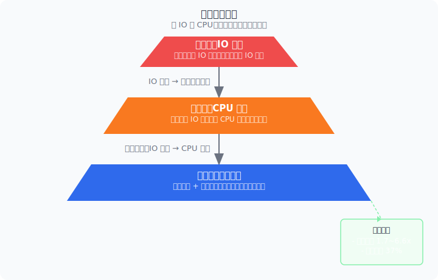
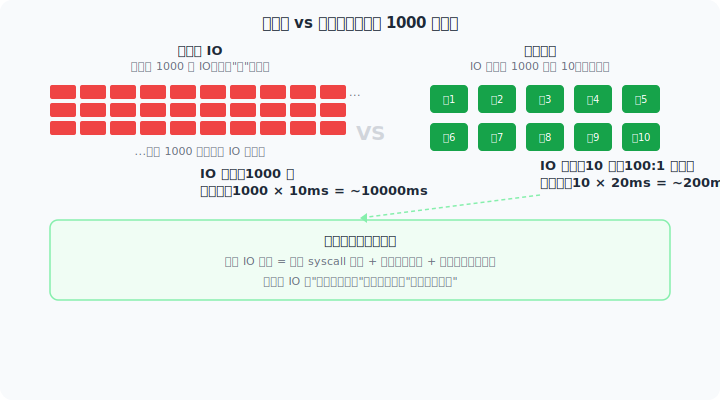
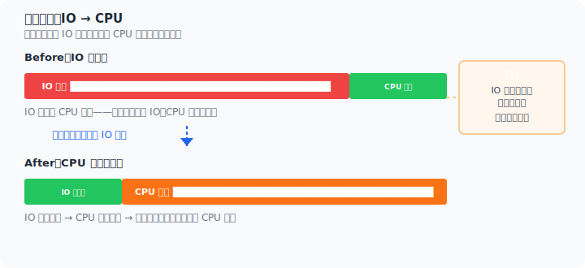
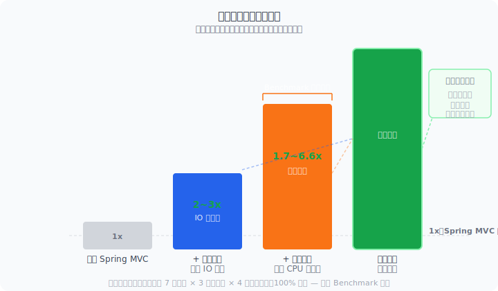

> [English](en/philosophy.md) | 中文

# 高性能 Java Web 的完整路径

---

## 引子：一个让人困惑的实验

2024 年，我们做了一个简单的对比测试——同样的业务逻辑（接收数据 → 校验 → 写入 Redis 和 ClickHouse），只是接入方式不同：

| 接入方式 | TPS |
|---------|-----|
| Kafka 消费端 | ~15,000 |
| Spring MVC（Tomcat） | < 4,000 |
| Spring WebFlux | < 4,000 |

Kafka 比 Spring MVC 快 4 倍，甚至连 WebFlux 也没好到哪去。**业务代码完全一样**，唯一的区别是 HTTP 那层框架。

这就引出了一个很直接的问题：如果框架本身就能吃掉 60% 的 CPU，那我们优化的方向到底是什么？

<p align="center">

</p>

---

## 第一层：IO 没那么简单

### WebFlux 解决的是哪个问题？

WebFlux 的出现是为了解决一个真实的问题：Tomcat 的线程模型在大量并发连接下撑不住。每个请求占一个线程，线程多了切换成本高，内存占用也大。

它的方案是**非阻塞 IO**——线程发起 IO 请求后不等着，先去处理别的事，数据到了再回来。

听起来不错。但这里有一个关键点：

**非阻塞 IO 没有减少 IO 次数。**

1000 个请求需要读 1000 次数据库，非阻塞 IO 让这 1000 次等待不阻塞线程了，但 1000 次 IO 一次没少。数据还是要从磁盘读到内存、通过网络传过来，物理延迟一点没变。

### 虚拟线程补了一刀

Java 21 的虚拟线程出来后，WebFlux 最核心的理由被削弱了。既然创建一个线程的代价和一个 `Mono` 对象差不多，那为什么要学一整套新语法？

对比一下两种写法的感觉：

**同步代码（直觉的）：**
```java
@GetMapping("/user/{id}")
public UserResp getUser(@PathVariable Long id) {
    User user = userRepo.findById(id);   // 读数据库
    String extra = extraService.get(id); // 调另一个服务
    return new UserResp(user, extra);
}
```

**响应式代码（需要学习的）：**
```java
@GetMapping("/user/{id}")
public Mono<UserResp> getUser(@PathVariable Long id) {
    return userRepo.findById(id)
        .zipWith(extraService.get(id))
        .map(tuple -> new UserResp(tuple.getT1(), tuple.getT2()));
}
```

哪个更容易看出 bug？显然是上面那个。这不是习惯问题——**同步代码的执行顺序就是读代码的顺序**，是人脑最自然的理解方式。

虚拟线程让同步模型的并发能力大幅提升，也顺势问出了那个不该问的问题：**为了非阻塞去学响应式编程，值吗？**

### 真正有效的 IO 优化是减少 IO

这才是本文想说的核心观点之一。

IO 优化的最优解不是"让等待 IO 的时间去干别的活"，而是**让 IO 少发生几次**。

```
非阻塞 IO： 1000 次 IO × 10ms = 10000ms 的 IO 等待
批量处理：  10 次 IO  × 20ms = 200ms  的 IO 等待（100:1 聚合）
```

批量处理每减少一次 IO，就省掉了一次 syscall、一次网络来回、一次对下游服务的冲击。这个收益是实实在在的，不是"藏起来"的。

本项目的 [`spring-web-batch`](batch.md) 模块基于 Disruptor 实现了透明请求聚合，开发者只需要写一个接收 `List` 的批量处理方法，框架自动将高并发的独立请求合并为批次处理。

<p align="center">

</p>

---

## 第二层：IO 被搞定后，CPU 浮出水面

### 让瓶颈现形

当你用批处理把 IO 压力降下来之后，就会发现一个新瓶颈——CPU。

这不是偶然，是必然的瓶颈转移。一个请求的生命周期大体是：

```
请求 → 路由匹配 → 参数解析 → 拦截器 → 参数校验 → 业务逻辑 → 序列化 → 响应
         ↑                          ↑                       ↑
       框架开销                    框架开销                 框架开销
```

当业务逻辑简单的时候（大部分微服务就是这样），框架开销的比例变得很刺眼。这就是为什么同样的业务逻辑，Kafka 端（几乎没有框架开销）能跑到 15000 TPS，而 Spring MVC 端被压在 4000 以下。

### Spring MVC 在 CPU 上到底花了什么钱？

我们对一个空方法接口做了 JFR 热点采样，得到的数据直接回答了这个问题：

- **内容协商 + 序列化编排** 占了 17~27%——不是 Jackson 序列化本身，而是 `selectHandler`、`getProducibleMediaTypes`、`canWrite` 这些每次请求都要重复做的事情
- **参数解析** 占 16~24%——解析器匹配、`GenericTypeResolver` 重新推断泛型类型、`EmptyBodyCheckingHttpInputMessage` 包装器创建
- **校验链** 占 1~7%——校验器查找和匹配

这些开销有一个非常一致的特征：**计算所需的信息在请求到达之前就已经确定了，但框架在运行时重新算了一遍。**

> 一个 URL 对应哪个方法、需要什么参数解析器、返回什么 MediaType——这些信息启动时就已知。但 Spring MVC 选择了"运行时匹配"的设计，把应该在启动期做的事推迟到了每次请求。

### "启动时做完"比"运行时优化"更根本

本项目的核心思路简单到一句话：**启动时把所有能确定的事都确定好，运行时只做查表。**

- **参数解析器**：启动时为每个方法参数确定解析器，运行时 `array[cacheIndex]` 直接取
- **返回值处理器**：启动时确定 MediaType 和处理器，运行时零遍历
- **路由**：O(1) HashMap 定位，不遍历 AntPathMatcher
- **反射调用**：ASM 字节码生成替代 `Method.invoke`

效果就是那几页 [性能原理](performance-principles.md) 里写的——框架开销趋近于零。不管请求长什么样，运行时路径都一样。

<p align="center">

</p>

---

## 第三层：两件事放一起才完整

### 不是"或者"，是"并且"

批量处理和基础优化不是两个独立的功能，它们是同一个方法论的两个阶段：

```
         IO 瓶颈               CPU 瓶颈
第一阶段：批处理 ─────────→   暴露出来  
第二阶段：                  基础优化 ───→ 消除
```

没有批处理，IO 掩盖了 CPU 问题，基础优化的收益看起来不大（反正都在等 IO）。
没有基础优化，批处理把 IO 干掉了，但 CPU 又成了新瓶颈，天花板还是上不去。
两者都有了，整条链路才真正畅通。

### 编程模型对比

| 维度 | WebPerf（本项目） | Spring WebFlux | Vert.x |
|------|---------------------|---------------|--------|
| 编程风格 | 同步 Spring MVC | 响应式 Reactor | 回调/Future |
| 学习曲线 | 零 | 高 | 中高 |
| 代码可读性 | 顺序执行 | 链式调用 | 回调嵌套 |
| 虚拟线程 | 天然兼容 | 意义减弱 | 天然兼容 |
| 批量处理 | 内置 Disruptor | 需自行实现 | 需自行实现 |

这张表的核心信息是：**相同或更好的性能 + 最低的迁移成本 = 本项目的位置。**

<p align="center">

</p>

---

## 零妥协：高性能与原生体验兼得

读到这你可能在想："所以我要换一个框架，重写所有代码？"

不需要。

本项目和"其他高性能方案"之间有一个根本性的哲学差异：

- **WebFlux** 说：你要高性能？那学 Reactor 吧。
- **Vert.x** 说：你要高性能？那写回调/Future 吧。
- **WebPerf** 说：**框架该干的活，框架自己干。**

你只需要在 `pom.xml` 里替换一行依赖：

```xml
<!-- 之前 -->
<dependency>
    <groupId>org.springframework.boot</groupId>
    <artifactId>spring-boot-starter-web</artifactId>
</dependency>

<!-- 之后 -->
<dependency>
    <groupId>io.github.springperf</groupId>
    <artifactId>spring-boot-starter-web</artifactId>
</dependency>
```

代码完全不用动。`@RestController` 还是 `@RestController`，`@RequestMapping` 还是 `@RequestMapping`，`@Validated` 还是 `@Validated`。

为什么能做到？因为本项目的设计前提就是**兼容 Spring 编程模型**。我们把性能优化的复杂性封装在了框架内部，而不是推给开发者。启动时预计算、字节码生成、O(1) 路由——这些技术细节对业务代码完全透明。

**所以你不必在"性能"和"开发效率"之间做选择。两者可以兼得。**

---

## 结语

回到开头的那个实验。Kafka 端之所以快，是因为它几乎没有框架开销——消息来了，直接调业务逻辑。

本项目的方向很简单：让 HTTP 接口也达到这个效率。不是通过换语言、换编程范式、让开发者学新东西，而是通过工程手段——**先批量处理干掉 IO 瓶颈，再基础优化干掉 CPU 瓶颈，最后保持 Spring MVC 编程体验不变。**

这不是一个"替代品"的故事，是一个"进化"的故事。

> - 想看具体的性能数据？→ [Benchmark 报告](benchmark.md)
> - 想看优化技术细节？→ [性能原理详解](performance-principles.md)
> - 想看批量处理怎么用？→ [Batch 模块文档](batch.md)
> - 想直接上手？→ [快速开始](quickstart.md)